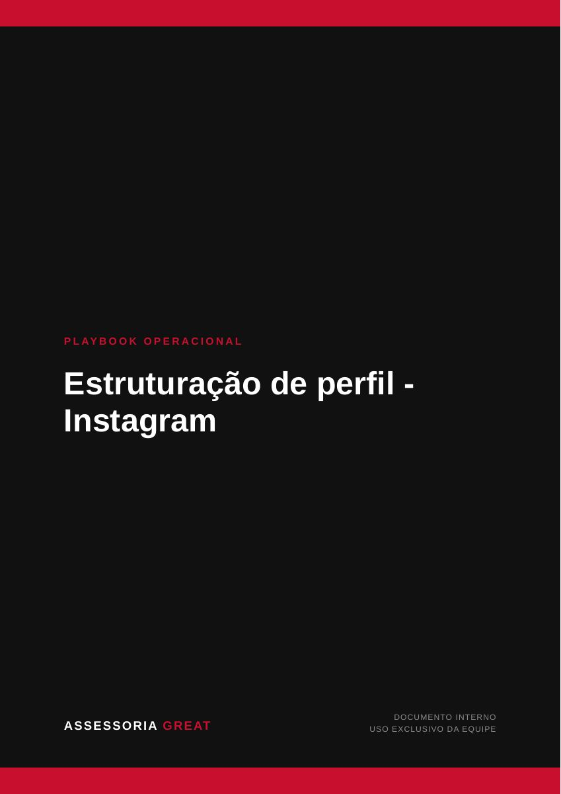
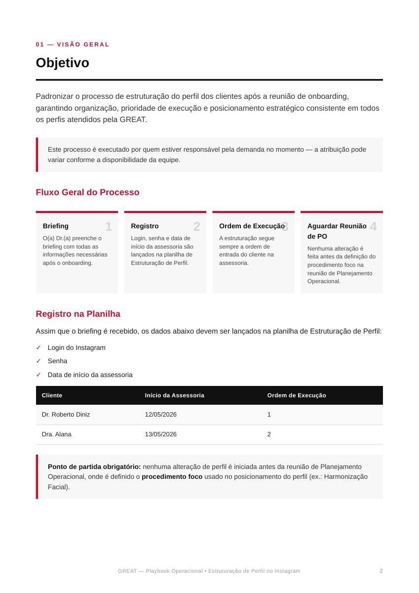
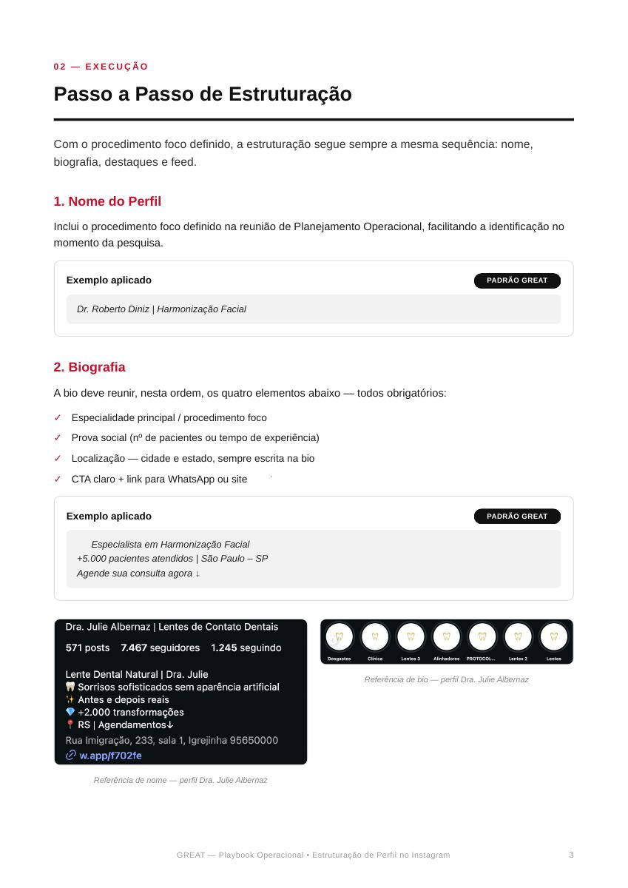
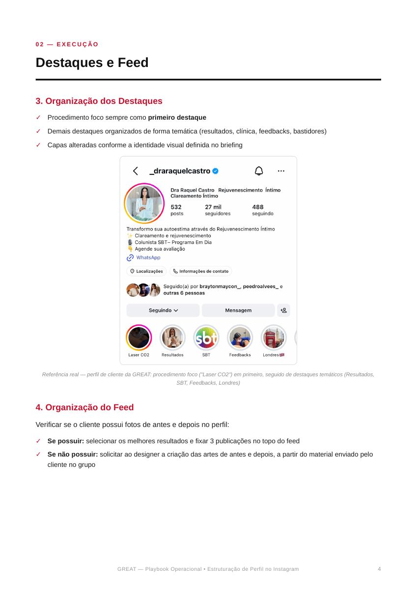
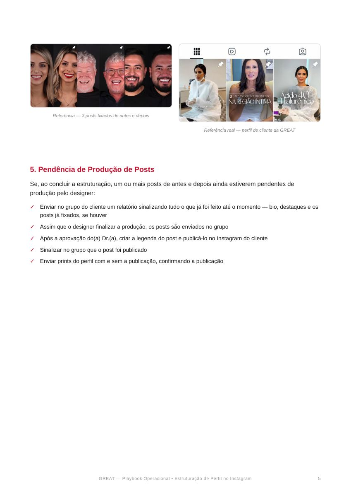
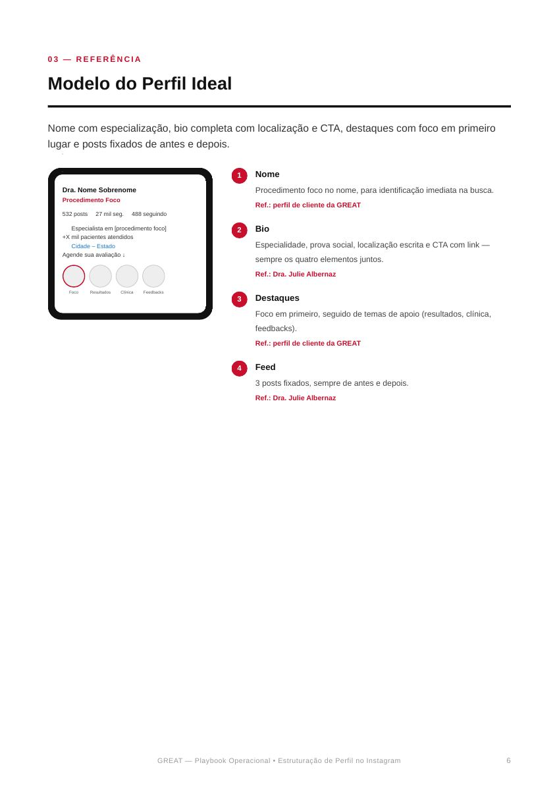
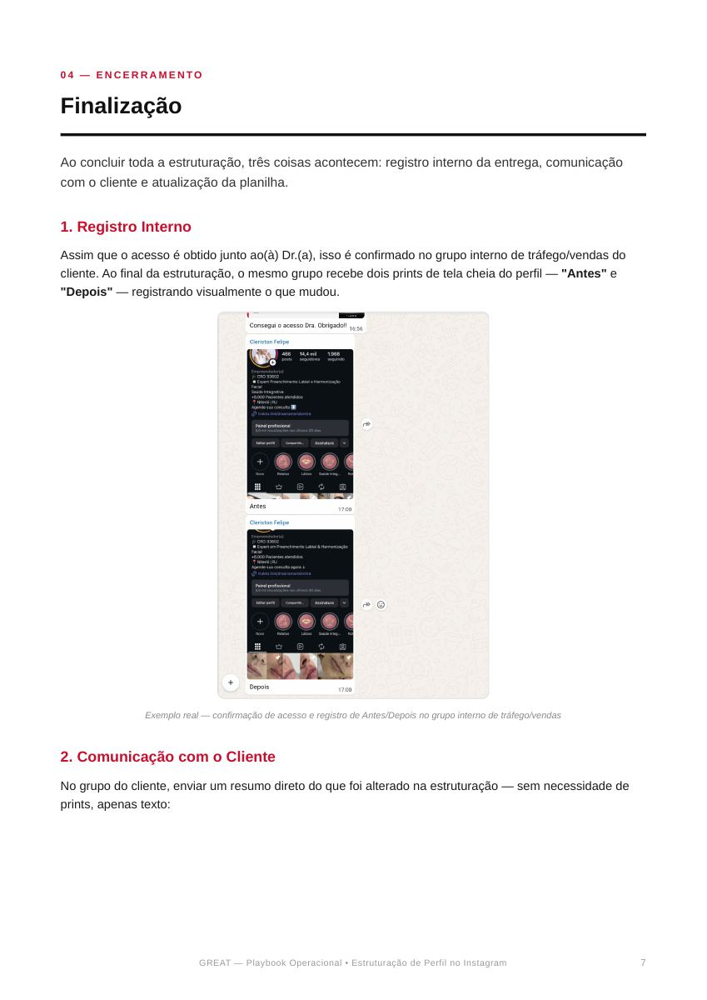
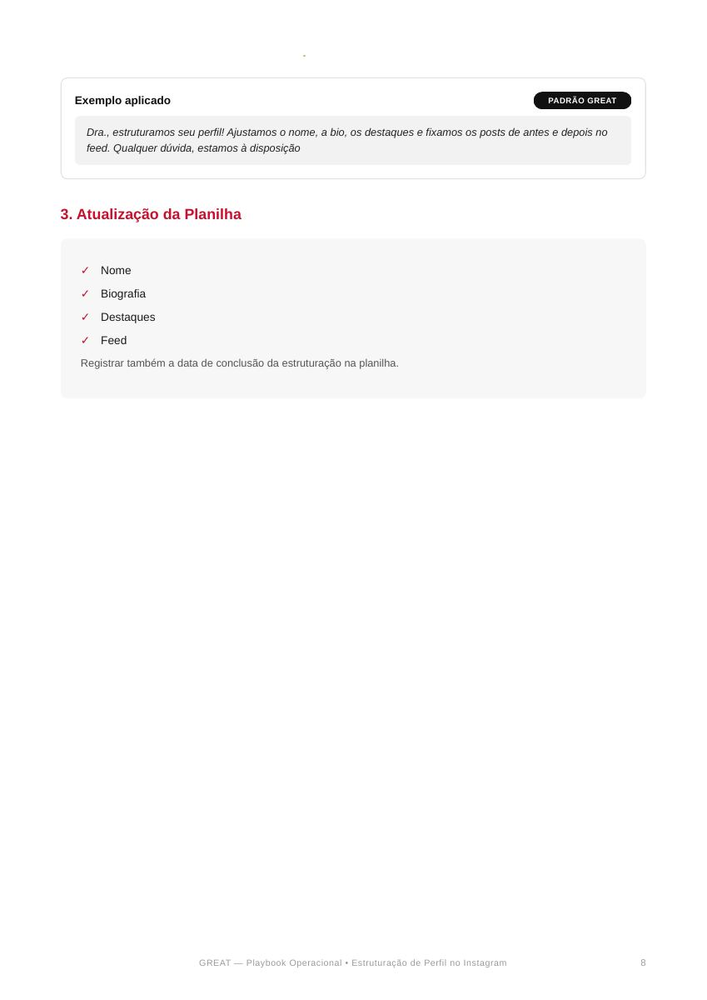
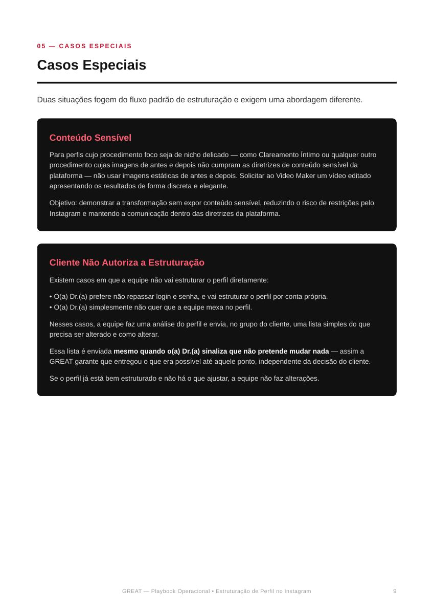

# Estruturação de Perfil - Instagram


**Transcrição integral:** `Playbook_Estruturacao_Perfil_Instagram_GREAT (4).pdf`. O conteúdo abaixo mantém a ordem das páginas e o texto completo extraído do PDF. A imagem de cada página preserva tabelas, diagramas, capturas de tela e demais elementos visuais do original.


## Página 1



<details>
<summary>Transcrição textual da página</summary>

```text
PLAYBOOK OPERACIONAL
Estruturação de perfil -
Instagram


                                          DOCUMENTO INTERNO
ASSESSORIA GREAT                       USO EXCLUSIVO DA EQUIPE
```

</details>

## Página 2



<details>
<summary>Transcrição textual da página</summary>

```text
01 — VISÃO GERAL
Objetivo


Padronizar o processo de estruturação do perfil dos clientes após a reunião de onboarding,
garantindo organização, prioridade de execução e posicionamento estratégico consistente em todos
os perfis atendidos pela GREAT.


    Este processo é executado por quem estiver responsável pela demanda no momento — a atribuição pode
    variar conforme a disponibilidade da equipe.


Fluxo Geral do Processo


  Briefing                            Registro                            Ordem de Execução                   Aguardar Reunião
  O(a) Dr.(a) preenche o              Login, senha e data de              A estruturação segue                de PO
  briefing com todas as               início da assessoria são            sempre a ordem de                   Nenhuma alteração é
  informações necessárias             lançados na planilha de             entrada do cliente na               feita antes da definição do
  após o onboarding.                  Estruturação de Perfil.             assessoria.                         procedimento foco na
                                                                                                              reunião de Planejamento
                                                                                                              Operacional.


Registro na Planilha

Assim que o briefing é recebido, os dados abaixo devem ser lançados na planilha de Estruturação de Perfil:

✓   Login do Instagram

✓   Senha
✓   Data de início da assessoria


  Cliente                                      Início da Assessoria                             Ordem de Execução


  Dr. Roberto Diniz                       12/05/2026                                      1


  Dra. Alana                               13/05/2026                                      2


    Ponto de partida obrigatório: nenhuma alteração de perfil é iniciada antes da reunião de Planejamento
    Operacional, onde é definido o procedimento foco usado no posicionamento do perfil (ex.: Harmonização
    Facial).


                                 GREAT — Playbook Operacional • Estruturação de Perfil no Instagram                                        2
```

</details>

## Página 3



<details>
<summary>Transcrição textual da página</summary>

```text
02 — EXECUÇÃO
Passo a Passo de Estruturação


Com o procedimento foco definido, a estruturação segue sempre a mesma sequência: nome,
biografia, destaques e feed.


1. Nome do Perfil

Inclui o procedimento foco definido na reunião de Planejamento Operacional, facilitando a identificação no
momento da pesquisa.


   Exemplo aplicado                                                                                          PADRÃO GREAT


     Dr. Roberto Diniz | Harmonização Facial


2. Biografia

A bio deve reunir, nesta ordem, os quatro elementos abaixo — todos obrigatórios:

✓   Especialidade principal / procedimento foco
✓   Prova social (nº de pacientes ou tempo de experiência)

✓   Localização — cidade e estado, sempre escrita na bio
✓   CTA claro + link para WhatsApp ou site


   Exemplo aplicado                                                                                          PADRÃO GREAT
     ✨ Especialista em Harmonização Facial
     +5.000 pacientes atendidos | São Paulo – SP 📍
     Agende sua consulta agora ↓


                                                                              Referência de bio — perfil Dra. Julie Albernaz


          Referência de nome — perfil Dra. Julie Albernaz


                               GREAT — Playbook Operacional • Estruturação de Perfil no Instagram                                 3
```

</details>

## Página 4



<details>
<summary>Transcrição textual da página</summary>

```text
02 — EXECUÇÃO
Destaques e Feed


3. Organização dos Destaques

✓   Procedimento foco sempre como primeiro destaque

✓   Demais destaques organizados de forma temática (resultados, clínica, feedbacks, bastidores)
✓   Capas alteradas conforme a identidade visual definida no briefing


  Referência real — perfil de cliente da GREAT: procedimento foco ("Laser CO2") em primeiro, seguido de destaques temáticos (Resultados,
                                                        SBT, Feedbacks, Londres)

4. Organização do Feed

Verificar se o cliente possui fotos de antes e depois no perfil:

✓   Se possuir: selecionar os melhores resultados e fixar 3 publicações no topo do feed

✓   Se não possuir: solicitar ao designer a criação das artes de antes e depois, a partir do material enviado pelo
    cliente no grupo


                                GREAT — Playbook Operacional • Estruturação de Perfil no Instagram                                      4
```

</details>

## Página 5



<details>
<summary>Transcrição textual da página</summary>

```text
           Referência — 3 posts fixados de antes e depois


                                                                                    Referência real — perfil de cliente da GREAT


5. Pendência de Produção de Posts

Se, ao concluir a estruturação, um ou mais posts de antes e depois ainda estiverem pendentes de
produção pelo designer:

✓   Enviar no grupo do cliente um relatório sinalizando tudo o que já foi feito até o momento — bio, destaques e os
    posts já fixados, se houver
✓   Assim que o designer finalizar a produção, os posts são enviados no grupo

✓   Após a aprovação do(a) Dr.(a), criar a legenda do post e publicá-lo no Instagram do cliente
✓   Sinalizar no grupo que o post foi publicado

✓   Enviar prints do perfil com e sem a publicação, confirmando a publicação


                                 GREAT — Playbook Operacional • Estruturação de Perfil no Instagram                                         5
```

</details>

## Página 6



<details>
<summary>Transcrição textual da página</summary>

```text
03 — REFERÊNCIA
Modelo do Perfil Ideal


Nome com especialização, bio completa com localização e CTA, destaques com foco em primeiro
lugar e posts fixados de antes e depois.


                                                               1     Nome

    Dra. Nome Sobrenome                                              Procedimento foco no nome, para identificação imediata na busca.
    Procedimento Foco                                                Ref.: perfil de cliente da GREAT

    532 posts   27 mil seg.   488 seguindo
    ✨ Especialista em [procedimento foco]                      2     Bio
    +X mil pacientes atendidos
    📍 Cidade – Estado                                                Especialidade, prova social, localização escrita e CTA com link —
    Agende sua avaliação ↓                                           sempre os quatro elementos juntos.

                                                                     Ref.: Dra. Julie Albernaz


       Foco       Resultados      Clínica      Feedbacks
                                                               3     Destaques
                                                                     Foco em primeiro, seguido de temas de apoio (resultados, clínica,
                                                                     feedbacks).

                                                                     Ref.: perfil de cliente da GREAT


                                                               4     Feed
                                                                     3 posts fixados, sempre de antes e depois.

                                                                     Ref.: Dra. Julie Albernaz


                                    GREAT — Playbook Operacional • Estruturação de Perfil no Instagram                                                  6
```

</details>

## Página 7



<details>
<summary>Transcrição textual da página</summary>

```text
04 — ENCERRAMENTO
Finalização


Ao concluir toda a estruturação, três coisas acontecem: registro interno da entrega, comunicação
com o cliente e atualização da planilha.


1. Registro Interno

Assim que o acesso é obtido junto ao(à) Dr.(a), isso é confirmado no grupo interno de tráfego/vendas do
cliente. Ao final da estruturação, o mesmo grupo recebe dois prints de tela cheia do perfil — "Antes" e
"Depois" — registrando visualmente o que mudou.


                  Exemplo real — confirmação de acesso e registro de Antes/Depois no grupo interno de tráfego/vendas

2. Comunicação com o Cliente

No grupo do cliente, enviar um resumo direto do que foi alterado na estruturação — sem necessidade de
prints, apenas texto:


                              GREAT — Playbook Operacional • Estruturação de Perfil no Instagram                                 7
```

</details>

## Página 8



<details>
<summary>Transcrição textual da página</summary>

```text
   Exemplo aplicado                                                                                                  PADRÃO GREAT


      Dra., estruturamos seu perfil! Ajustamos o nome, a bio, os destaques e fixamos os posts de antes e depois no
      feed. Qualquer dúvida, estamos à disposição 🙂


3. Atualização da Planilha


    ✓    Nome
    ✓    Biografia

    ✓    Destaques
    ✓    Feed

    Registrar também a data de conclusão da estruturação na planilha.


                                 GREAT — Playbook Operacional • Estruturação de Perfil no Instagram                                        8
```

</details>

## Página 9



<details>
<summary>Transcrição textual da página</summary>

```text
05 — CASOS ESPECIAIS
Casos Especiais


Duas situações fogem do fluxo padrão de estruturação e exigem uma abordagem diferente.


    Conteúdo Sensível

    Para perfis cujo procedimento foco seja de nicho delicado — como Clareamento Íntimo ou qualquer outro
    procedimento cujas imagens de antes e depois não cumpram as diretrizes de conteúdo sensível da
    plataforma — não usar imagens estáticas de antes e depois. Solicitar ao Video Maker um vídeo editado
    apresentando os resultados de forma discreta e elegante.

    Objetivo: demonstrar a transformação sem expor conteúdo sensível, reduzindo o risco de restrições pelo
    Instagram e mantendo a comunicação dentro das diretrizes da plataforma.


    Cliente Não Autoriza a Estruturação

    Existem casos em que a equipe não vai estruturar o perfil diretamente:

    • O(a) Dr.(a) prefere não repassar login e senha, e vai estruturar o perfil por conta própria.
    • O(a) Dr.(a) simplesmente não quer que a equipe mexa no perfil.

    Nesses casos, a equipe faz uma análise do perfil e envia, no grupo do cliente, uma lista simples do que
    precisa ser alterado e como alterar.

    Essa lista é enviada mesmo quando o(a) Dr.(a) sinaliza que não pretende mudar nada — assim a
    GREAT garante que entregou o que era possível até aquele ponto, independente da decisão do cliente.

    Se o perfil já está bem estruturado e não há o que ajustar, a equipe não faz alterações.


                                GREAT — Playbook Operacional • Estruturação de Perfil no Instagram                                   9
```

</details>
