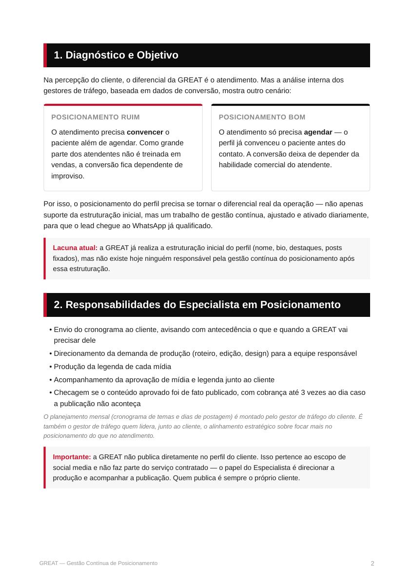
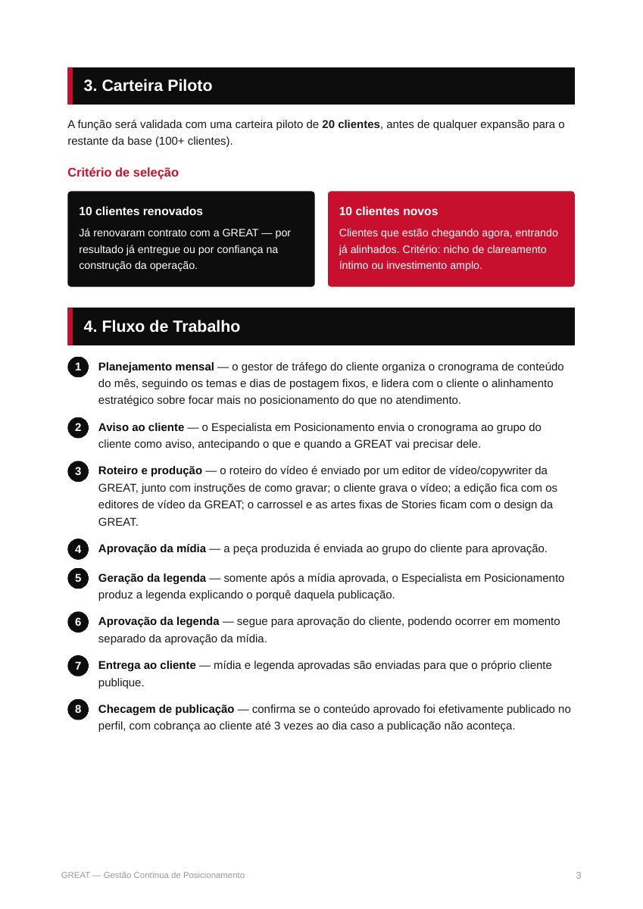
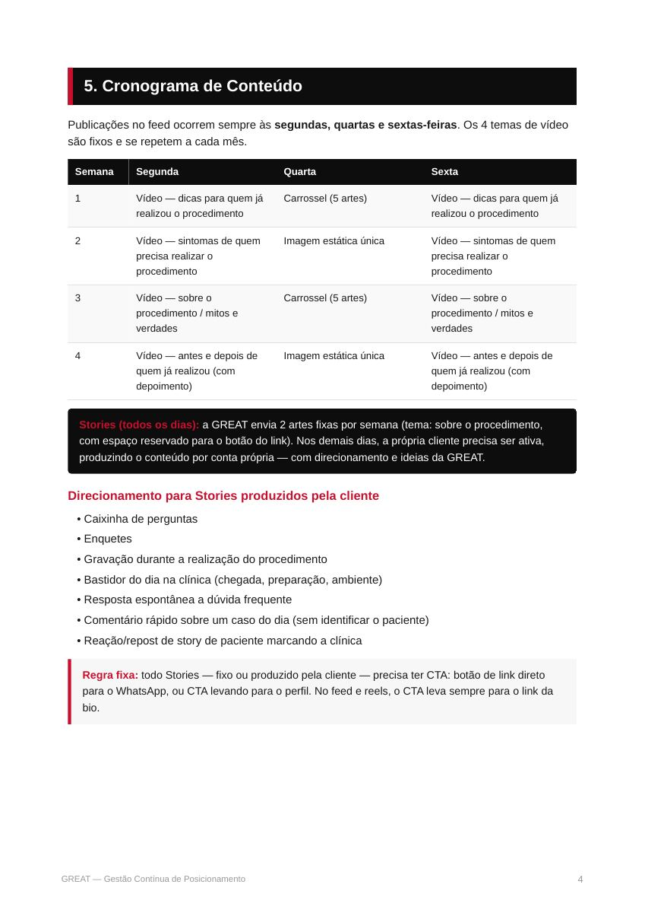
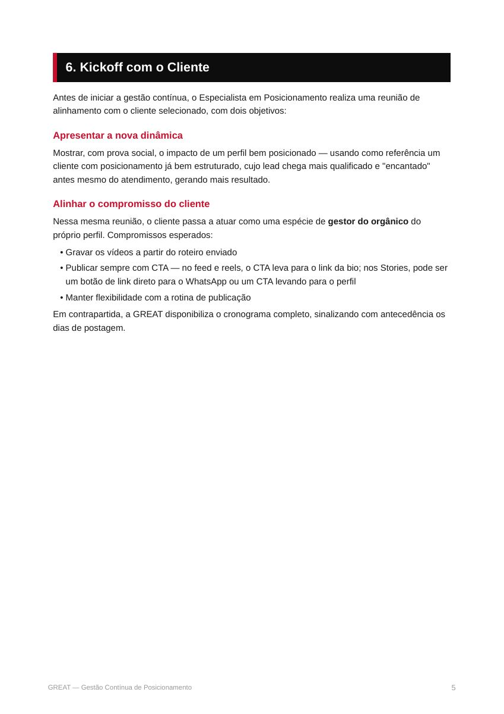

# Gestão Contínua de Posicionamento


**Transcrição integral:** `Playbook - Gestão Contínua de Posicionamento (1).pdf`. O conteúdo abaixo mantém a ordem das páginas e o texto completo extraído do PDF. A imagem de cada página preserva tabelas, diagramas, capturas de tela e demais elementos visuais do original.


## Página 1


<details>
<summary>Transcrição textual da página</summary>

```text
Gestão Contínua de
Posicionamento

PLAYBOOK DO ESPECIALISTA EM POSICIONAMENTO


ASSESSORIA GREAT
```

</details>

## Página 2



<details>
<summary>Transcrição textual da página</summary>

```text
     1. Diagnóstico e Objetivo


 Na percepção do cliente, o diferencial da GREAT é o atendimento. Mas a análise interna dos
 gestores de tráfego, baseada em dados de conversão, mostra outro cenário:


    POSICIONAMENTO RUIM                                           POSICIONAMENTO BOM

    O atendimento precisa convencer o                             O atendimento só precisa agendar — o
    paciente além de agendar. Como grande                         perfil já convenceu o paciente antes do
    parte dos atendentes não é treinada em                        contato. A conversão deixa de depender da
    vendas, a conversão fica dependente de                        habilidade comercial do atendente.
    improviso.


 Por isso, o posicionamento do perfil precisa se tornar o diferencial real da operação — não apenas
 suporte da estruturação inicial, mas um trabalho de gestão contínua, ajustado e ativado diariamente,
 para que o lead chegue ao WhatsApp já qualificado.


     Lacuna atual: a GREAT já realiza a estruturação inicial do perfil (nome, bio, destaques, posts
     fixados), mas não existe hoje ninguém responsável pela gestão contínua do posicionamento após
     essa estruturação.


     2. Responsabilidades do Especialista em Posicionamento


   • Envio do cronograma ao cliente, avisando com antecedência o que e quando a GREAT vai
     precisar dele
   • Direcionamento da demanda de produção (roteiro, edição, design) para a equipe responsável
   • Produção da legenda de cada mídia
   • Acompanhamento da aprovação de mídia e legenda junto ao cliente
   • Checagem se o conteúdo aprovado foi de fato publicado, com cobrança até 3 vezes ao dia caso
     a publicação não aconteça

 O planejamento mensal (cronograma de temas e dias de postagem) é montado pelo gestor de tráfego do cliente. É
 também o gestor de tráfego quem lidera, junto ao cliente, o alinhamento estratégico sobre focar mais no
 posicionamento do que no atendimento.


     Importante: a GREAT não publica diretamente no perfil do cliente. Isso pertence ao escopo de
     social media e não faz parte do serviço contratado — o papel do Especialista é direcionar a
     produção e acompanhar a publicação. Quem publica é sempre o próprio cliente.


GREAT — Gestão Contínua de Posicionamento                                                                                  2
```

</details>

## Página 3



<details>
<summary>Transcrição textual da página</summary>

```text
     3. Carteira Piloto


 A função será validada com uma carteira piloto de 20 clientes, antes de qualquer expansão para o
 restante da base (100+ clientes).

 Critério de seleção


    10 clientes renovados                                        10 clientes novos

    Já renovaram contrato com a GREAT — por                      Clientes que estão chegando agora, entrando
    resultado já entregue ou por confiança na                    já alinhados. Critério: nicho de clareamento
    construção da operação.                                      íntimo ou investimento amplo.


     4. Fluxo de Trabalho


   1    Planejamento mensal — o gestor de tráfego do cliente organiza o cronograma de conteúdo
        do mês, seguindo os temas e dias de postagem fixos, e lidera com o cliente o alinhamento
        estratégico sobre focar mais no posicionamento do que no atendimento.

   2    Aviso ao cliente — o Especialista em Posicionamento envia o cronograma ao grupo do
        cliente como aviso, antecipando o que e quando a GREAT vai precisar dele.

   3    Roteiro e produção — o roteiro do vídeo é enviado por um editor de vídeo/copywriter da
        GREAT, junto com instruções de como gravar; o cliente grava o vídeo; a edição fica com os
        editores de vídeo da GREAT; o carrossel e as artes fixas de Stories ficam com o design da
        GREAT.

   4    Aprovação da mídia — a peça produzida é enviada ao grupo do cliente para aprovação.

   5    Geração da legenda — somente após a mídia aprovada, o Especialista em Posicionamento
        produz a legenda explicando o porquê daquela publicação.

   6    Aprovação da legenda — segue para aprovação do cliente, podendo ocorrer em momento
        separado da aprovação da mídia.

   7    Entrega ao cliente — mídia e legenda aprovadas são enviadas para que o próprio cliente
        publique.

   8    Checagem de publicação — confirma se o conteúdo aprovado foi efetivamente publicado no
        perfil, com cobrança ao cliente até 3 vezes ao dia caso a publicação não aconteça.


GREAT — Gestão Contínua de Posicionamento                                                                               3
```

</details>

## Página 4



<details>
<summary>Transcrição textual da página</summary>

```text
     5. Cronograma de Conteúdo


 Publicações no feed ocorrem sempre às segundas, quartas e sextas-feiras. Os 4 temas de vídeo
 são fixos e se repetem a cada mês.

   Semana      Segunda                            Quarta                              Sexta

   1              Vídeo — dicas para quem já            Carrossel (5 artes)                 Vídeo — dicas para quem já
                  realizou o procedimento                                                    realizou o procedimento

   2              Vídeo — sintomas de quem              Imagem estática única            Vídeo — sintomas de quem
                  precisa realizar o                                                         precisa realizar o
                  procedimento                                                               procedimento

   3              Vídeo — sobre o                       Carrossel (5 artes)                 Vídeo — sobre o
                  procedimento / mitos e                                                     procedimento / mitos e
                  verdades                                                                   verdades

   4              Vídeo — antes e depois de             Imagem estática única            Vídeo — antes e depois de
                  quem já realizou (com                                                      quem já realizou (com
                  depoimento)                                                                depoimento)


    Stories (todos os dias): a GREAT envia 2 artes fixas por semana (tema: sobre o procedimento,
    com espaço reservado para o botão do link). Nos demais dias, a própria cliente precisa ser ativa,
    produzindo o conteúdo por conta própria — com direcionamento e ideias da GREAT.


 Direcionamento para Stories produzidos pela cliente

   • Caixinha de perguntas
   • Enquetes
   • Gravação durante a realização do procedimento
   • Bastidor do dia na clínica (chegada, preparação, ambiente)
   • Resposta espontânea a dúvida frequente
   • Comentário rápido sobre um caso do dia (sem identificar o paciente)
   • Reação/repost de story de paciente marcando a clínica


     Regra fixa: todo Stories — fixo ou produzido pela cliente — precisa ter CTA: botão de link direto
     para o WhatsApp, ou CTA levando para o perfil. No feed e reels, o CTA leva sempre para o link da
     bio.


GREAT — Gestão Contínua de Posicionamento                                                                                         4
```

</details>

## Página 5



<details>
<summary>Transcrição textual da página</summary>

```text
     6. Kickoff com o Cliente


 Antes de iniciar a gestão contínua, o Especialista em Posicionamento realiza uma reunião de
 alinhamento com o cliente selecionado, com dois objetivos:

 Apresentar a nova dinâmica

 Mostrar, com prova social, o impacto de um perfil bem posicionado — usando como referência um
 cliente com posicionamento já bem estruturado, cujo lead chega mais qualificado e "encantado"
 antes mesmo do atendimento, gerando mais resultado.

 Alinhar o compromisso do cliente

 Nessa mesma reunião, o cliente passa a atuar como uma espécie de gestor do orgânico do
 próprio perfil. Compromissos esperados:

   • Gravar os vídeos a partir do roteiro enviado
   • Publicar sempre com CTA — no feed e reels, o CTA leva para o link da bio; nos Stories, pode ser
     um botão de link direto para o WhatsApp ou um CTA levando para o perfil
   • Manter flexibilidade com a rotina de publicação
 Em contrapartida, a GREAT disponibiliza o cronograma completo, sinalizando com antecedência os
 dias de postagem.


GREAT — Gestão Contínua de Posicionamento                                                                                5
```

</details>
