# Playbook do design


**Transcrição integral:** `Playbook_do_Design_Completo (2).pdf`. O conteúdo abaixo mantém a ordem das páginas e o texto completo extraído do PDF. A imagem de cada página preserva tabelas, diagramas, capturas de tela e demais elementos visuais do original.


## Página 1

.jpg>)

<details>

<summary>Transcrição textual da página</summary>

```
PLAYBOOK DO
   DESIGN
```

</details>

## Página 2

.jpg>)

<details>

<summary>Transcrição textual da página</summary>

```
  O que você vai aprender


Este playbook reúne, em um só lugar, tudo o que o designer gráfico da GREAT
precisa saber para atuar no dia a dia da agência: como o briefing chega até ele,
como produzir e aprovar cada arte, como subir os criativos na plataforma e qual é
a rotina diária esperada — sempre respeitando o ritmo fixo de 2 a 3 artes por
cliente por semana, sem exceção.

    1    Responsabilidades do Designer Gráfico
         O papel do design dentro da operação da Assessoria GREAT.

           Acessar documento →


    2    Como Acessar o Briefing na Plataforma GREAT
         Passo a passo para encontrar o briefing de cada cliente na plataforma.

           Acessar documento →

    3    Como Subir um Criativo na Plataforma GREAT
         Tutorial passo a passo de como o designer sobe o criativo na plataforma.

           Acessar documento →


    4    Planilha de Controle de Produção
         Como o designer registra e acompanha as artes da semana.

           Acessar documento →


    5    Fluxo até a Demanda Chegar no Designer
         Da formação do grupo do cliente ao briefing que orienta a produção.

           Acessar documento →

    6    Sistema de Aprovação da Arte
         Da aprovação interna à aprovação do cliente, e o que vem depois.

           Acessar documento →


    7    Rotina Diária do Designer
         O que fazer, quando fazer e como fazer.

           Acessar documento →


                            Assessoria GREAT · Índice · Uso exclusivo da equipe
```

</details>

## Página 3

.jpg>)

<details>

<summary>Transcrição textual da página</summary>

```
8     Copy e Canva: Recursos do Designer
      O prompt para gerar a copy no ChatGPT e o link de acesso ao Canva.

        Acessar documento →


                          Assessoria GREAT · Índice · Uso exclusivo da equipe
```

</details>

## Página 4

.jpg>)

<details>

<summary>Transcrição textual da página</summary>

```
DOCUMENTO 1


   RESPONSABILIDADES DO
      DESIGNER GRÁFICO
```

</details>

## Página 5

.jpg>)

<details>

<summary>Transcrição textual da página</summary>

```
  O papel do design na GREAT


O designer gráfico é a peça que transforma briefing em material pronto para uso
— seja para campanhas de tráfego pago, seja para o Instagram do próprio cliente.
É o setor que entrega, literalmente todos os dias, o produto visual que sustenta o
resultado de cada conta da agência.


   Regra fixa de ritmo
   Todo cliente da GREAT que tiver criação de conteúdo no plano recebe de 2 a 3
   artes por semana, sem exceção. Esse ritmo não varia por tamanho de conta, tipo
   de clínica ou momento de campanha — é um padrão mínimo de entrega da
   agência.


  Onde o design entra no fluxo da agência


O trabalho do designer não começa do zero a cada arte — ele é a etapa central de um
fluxo maior, que passa por outras equipes antes e depois dele:


  Comercial cria o grupo do cliente e adiciona o gestor de onboarding

                                                   ↓


  Gestor de onboarding adiciona o designer ao grupo (se o plano incluir conteúdo) e
  confere o briefing preenchido pelo cliente

                                                   ↓


  Designer produz a arte com base no briefing — solicita imagens de “antes e
  depois” ao cliente dentro do grupo. Se o cliente tiver, usa como referência. Se não
  tiver, verifica se pode usar imagens da internet. Caso não seja possível usar “antes
  e depois”, cria a arte com imagem da internet ou gerada por IA

                                                   ↓


  Líder de estratégias aprova internamente (ou devolve para ajuste)

                                                   ↓


                Assessoria GREAT · Responsabilidades do Designer · Uso exclusivo da equipe
```

</details>

## Página 6

.jpg>)

<details>

<summary>Transcrição textual da página</summary>

```
  Cliente aprova no grupo (ou pede ajuste, retornando à aprovação interna)

                                                  ↓


  Designer sobe o criativo na plataforma GREAT (quando for para tráfego pago) ou
  envia no WhatsApp privado do gestor responsável (quando for para o Instagram do
  cliente) e sinaliza o destino


Cada uma dessas etapas é detalhada nos documentos seguintes deste playbook.


  Documentos complementares deste Playbook


Este é o primeiro de oito documentos que compõem o Playbook do Design. Os outros
sete detalham, passo a passo, cada parte do fluxo resumido acima:

 2     Como Acessar o Briefing na Plataforma GREAT
       Passo a passo para encontrar o briefing de cada cliente na plataforma.

 3     Como Subir um Criativo na Plataforma GREAT
       Passo a passo de como o designer cadastra a arte aprovada na ficha do cliente.

 4     Planilha de Controle de Produção
       Como o designer registra, por cliente e por dia, a quantidade e o status de cada
       arte produzida.

 5     Fluxo até a Demanda Chegar no Designer
       Da formação do grupo do cliente ao briefing que orienta a produção.

 6     Sistema de Aprovação da Arte
       Da aprovação interna (líder de estratégias) à aprovação do cliente, e o que
       acontece depois.

 7     Rotina Diária do Designer
       O que fazer, em que ordem, do início ao fim do expediente.

 8     Copy e Canva: Recursos do Designer
       O prompt fixo usado para gerar a copy no ChatGPT e o link de acesso ao Canva.


  Em resumo


                Assessoria GREAT · Responsabilidades do Designer · Uso exclusivo da equipe
```

</details>

## Página 7

.jpg>)

<details>

<summary>Transcrição textual da página</summary>

```
O designer gráfico é responsável por um volume fixo e constante de entregas,
dentro de um fluxo que envolve onboarding, estratégia e o próprio cliente.
Entender esse encadeamento é o que torna possível manter a qualidade e o ritmo
de 2 a 3 artes por semana, para todos os clientes, sem exceção.


                                          ↑ Voltar ao Início


              Assessoria GREAT · Responsabilidades do Designer · Uso exclusivo da equipe
```

</details>

## Página 8

.jpg>)

<details>

<summary>Transcrição textual da página</summary>

```
DOCUMENTO 2


       COMO ACESSAR O
           BRIEFING
   NA PLATAFORMA GREAT
```

</details>

## Página 9

.jpg>)

<details>

<summary>Transcrição textual da página</summary>

```
  Para que serve esse passo a passo


O briefing de cada cliente fica armazenado dentro da plataforma GREAT, na ficha
individual do cliente. Este documento mostra como chegar até ele em 4 passos
simples.


  Passo a passo


 1     Acessar a plataforma e ir para “Meu Dia”
       Ao entrar na plataforma GREAT, você já cai na tela principal — o Meu Dia. A
       partir daqui, basta navegar pelo menu lateral para chegar ao briefing.


                    Tela “Meu Dia” — ponto de partida dentro da plataforma GREAT.

 2     Clicar em “CRM Operacional” no menu lateral
       No menu lateral esquerdo, clique em CRM Operacional. Você verá a lista
       completa de todos os clientes da agência, com informações de status e criativos
       pendentes.


                   Assessoria GREAT · Como Acessar o Briefing · Uso exclusivo da equipe
```

</details>

## Página 10

.jpg>)

<details>

<summary>Transcrição textual da página</summary>

```
                     Tela “CRM Operacional” — lista de todos os clientes da agência.

3     Clicar no cliente desejado
      Encontre o cliente na lista e clique no nome dele para abrir a ficha completa. Na
      ficha, você encontra as informações da conta, status, criativos e — o que
      precisamos — a seção Arquivos, onde o briefing está armazenado.


                   Ficha do cliente — localize a seção “Arquivos” com o PDF do briefing.


                    Assessoria GREAT · Como Acessar o Briefing · Uso exclusivo da equipe
```

</details>

## Página 11

.jpg>)

<details>

<summary>Transcrição textual da página</summary>

```
4    Clicar no arquivo para abrir o briefing
     Na seção Arquivos, clique no arquivo PDF listado. O briefing abre diretamente —
     ele contém todas as informações preenchidas pelo cliente na reunião de
     onboarding, incluindo dados da empresa, responsável pelo projeto, acessos ao
     Instagram e Facebook/Meta Ads.


        Briefing aberto — Formulário ASSESSORIA GREAT com todas as informações do cliente.


 Onde fica o briefing
 O briefing é sempre o arquivo PDF listado na seção “Arquivos” da ficha do cliente
 no CRM Operacional. Ele é preenchido pelo próprio cliente e conferido pelo gestor
 de onboarding na reunião de Start. Contém os dados essenciais para a produção
 das artes: nome do negócio, responsável, endereço e acessos necessários.


                                           ↑ Voltar ao Início


                   Assessoria GREAT · Como Acessar o Briefing · Uso exclusivo da equipe
```

</details>

## Página 12

.jpg>)

<details>

<summary>Transcrição textual da página</summary>

```
DOCUMENTO 3


  COMO SUBIR UM CRIATIVO
   NA PLATAFORMA GREAT
```

</details>

## Página 13

.jpg>)

<details>

<summary>Transcrição textual da página</summary>

```
  Quando usar


Depois que uma arte é aprovada pelo cliente e seu destino for tráfego pago, o
designer sobe o criativo final na Plataforma GREAT. É esse upload que disponibiliza
a arte para o gestor de tráfego publicar no Gerenciador de Anúncios.


   Quem pode subir criativos
   Apenas os especialistas da produção de conteúdo podem adicionar novos
   criativos na plataforma. O gestor de tráfego apenas consulta os criativos já
   aprovados e sinaliza quando um anúncio foi publicado no Gerenciador de Anúncios
   da Meta.


  Passo a passo


 1     Acessar o CRM Operacional
       No menu lateral, clique em “CRM Operacional”. A tela mostra o total de clientes
       da agência e, na lista de “Criativos pendentes”, quantos criativos aprovados
       aguardam para serem subidos em cada conta.


              Tela “CRM Operacional” — lista de clientes e criativos pendentes por cliente.


             Assessoria GREAT · Como Subir um Criativo na Plataforma · Uso exclusivo da equipe
```

</details>

## Página 14

.jpg>)

<details>

<summary>Transcrição textual da página</summary>

```
2     Abrir a ficha do cliente
      Clique no nome do cliente para abrir a ficha completa, com as informações da
      conta e o card “Criativos”, dividido entre “Anúncios para Subir” e “Anúncios
      Ativos”.


                  Ficha do cliente — card de Criativos com o botão “Adicionar Criativo”.

3     Clicar em “Adicionar Criativo”
      Abre o modal “Adicionar Criativo — [nome do cliente]”, com o campo
      “Responsável pela Arte” e a área de upload de arquivos (fotos, vídeos, áudios).


            Assessoria GREAT · Como Subir um Criativo na Plataforma · Uso exclusivo da equipe
```

</details>

## Página 15

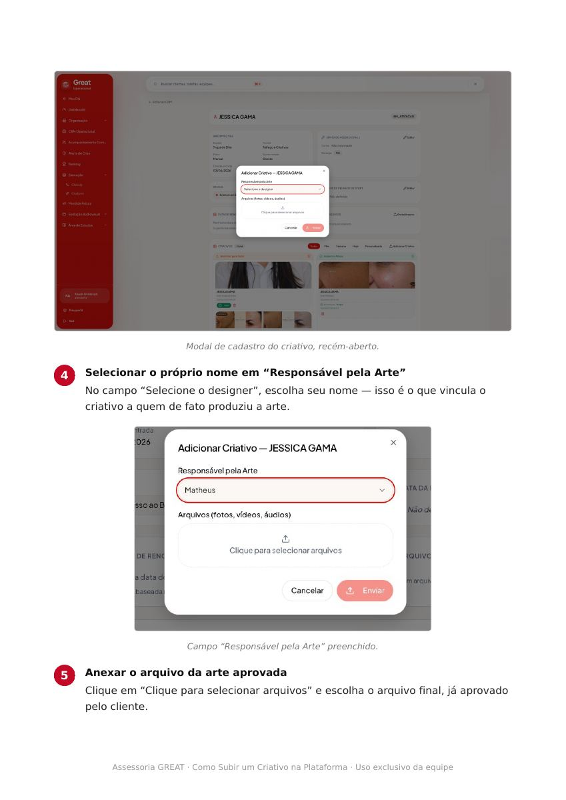

<details>

<summary>Transcrição textual da página</summary>

```
                              Modal de cadastro do criativo, recém-aberto.

4     Selecionar o próprio nome em “Responsável pela Arte”
      No campo “Selecione o designer”, escolha seu nome — isso é o que vincula o
      criativo a quem de fato produziu a arte.


                               Campo “Responsável pela Arte” preenchido.

5     Anexar o arquivo da arte aprovada
      Clique em “Clique para selecionar arquivos” e escolha o arquivo final, já aprovado
      pelo cliente.


            Assessoria GREAT · Como Subir um Criativo na Plataforma · Uso exclusivo da equipe
```

</details>

## Página 16

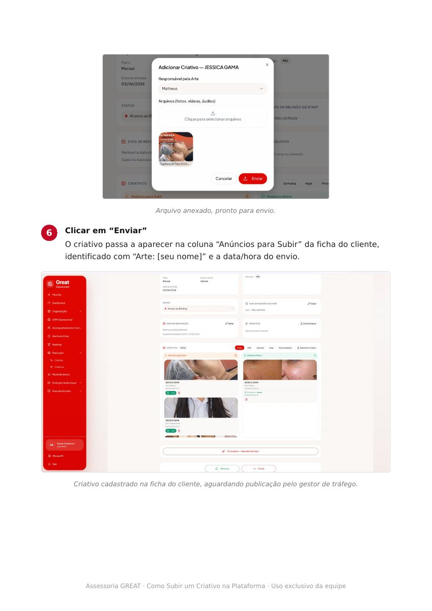

<details>

<summary>Transcrição textual da página</summary>

```
                                     Arquivo anexado, pronto para envio.

6     Clicar em “Enviar”
      O criativo passa a aparecer na coluna “Anúncios para Subir” da ficha do cliente,
      identificado com “Arte: [seu nome]” e a data/hora do envio.


         Criativo cadastrado na ficha do cliente, aguardando publicação pelo gestor de tráfego.


             Assessoria GREAT · Como Subir um Criativo na Plataforma · Uso exclusivo da equipe
```

</details>

## Página 17

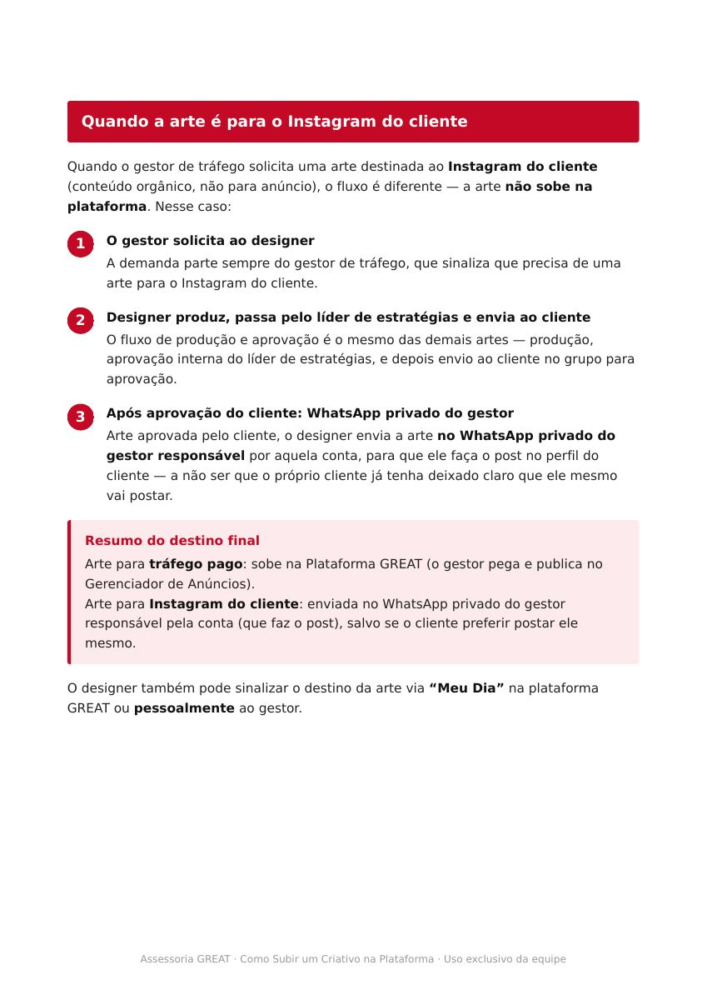

<details>

<summary>Transcrição textual da página</summary>

```
  Quando a arte é para o Instagram do cliente


Quando o gestor de tráfego solicita uma arte destinada ao Instagram do cliente
(conteúdo orgânico, não para anúncio), o fluxo é diferente — a arte não sobe na
plataforma. Nesse caso:

 1     O gestor solicita ao designer
       A demanda parte sempre do gestor de tráfego, que sinaliza que precisa de uma
       arte para o Instagram do cliente.

 2     Designer produz, passa pelo líder de estratégias e envia ao cliente
       O fluxo de produção e aprovação é o mesmo das demais artes — produção,
       aprovação interna do líder de estratégias, e depois envio ao cliente no grupo para
       aprovação.

 3     Após aprovação do cliente: WhatsApp privado do gestor
       Arte aprovada pelo cliente, o designer envia a arte no WhatsApp privado do
       gestor responsável por aquela conta, para que ele faça o post no perfil do
       cliente — a não ser que o próprio cliente já tenha deixado claro que ele mesmo
       vai postar.


   Resumo do destino final
   Arte para tráfego pago: sobe na Plataforma GREAT (o gestor pega e publica no
   Gerenciador de Anúncios).
   Arte para Instagram do cliente: enviada no WhatsApp privado do gestor
   responsável pela conta (que faz o post), salvo se o cliente preferir postar ele
   mesmo.


O designer também pode sinalizar o destino da arte via “Meu Dia” na plataforma
GREAT ou pessoalmente ao gestor.


             Assessoria GREAT · Como Subir um Criativo na Plataforma · Uso exclusivo da equipe
```

</details>

## Página 18

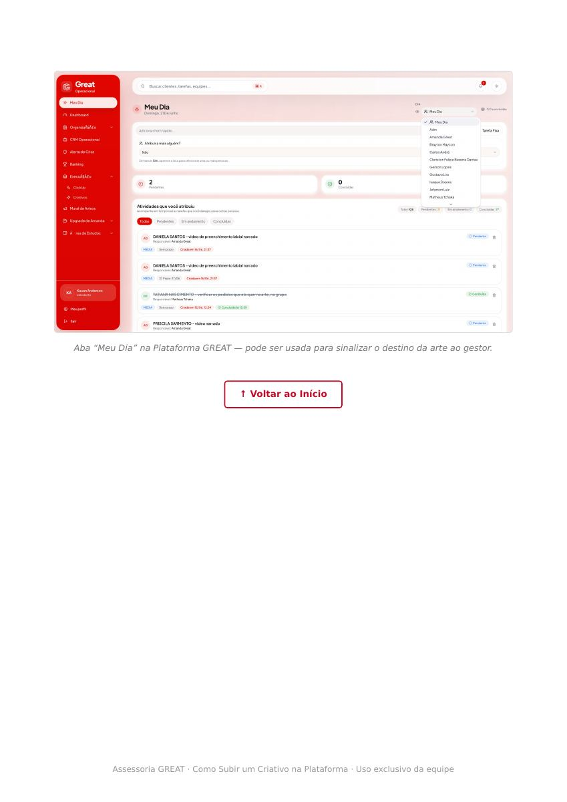

<details>

<summary>Transcrição textual da página</summary>

```
Aba “Meu Dia” na Plataforma GREAT — pode ser usada para sinalizar o destino da arte ao gestor.


                                               ↑ Voltar ao Início


          Assessoria GREAT · Como Subir um Criativo na Plataforma · Uso exclusivo da equipe
```

</details>

## Página 19

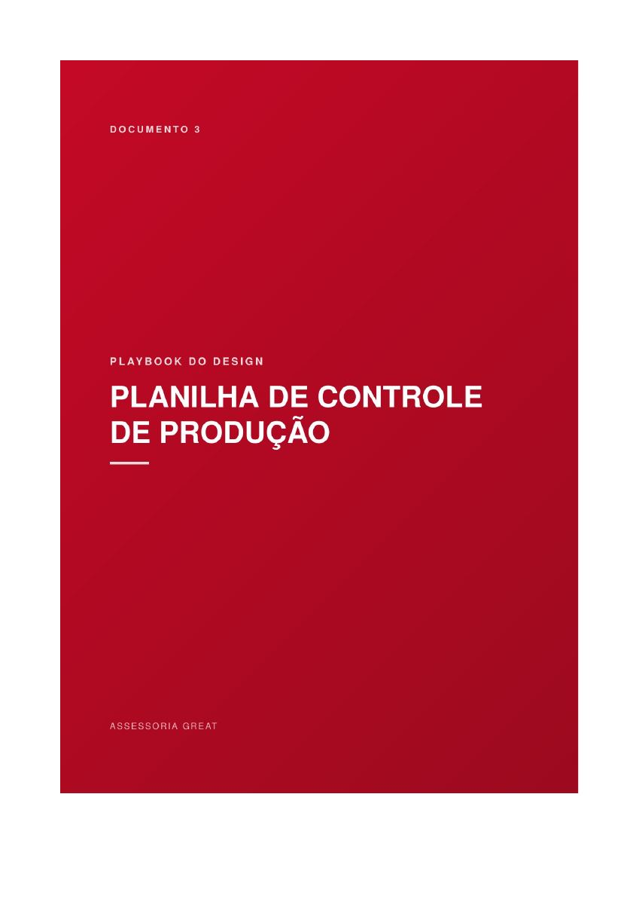

<details>

<summary>Transcrição textual da página</summary>

```
[Página sem texto extraível; consulte a imagem acima.]
```

</details>

## Página 20

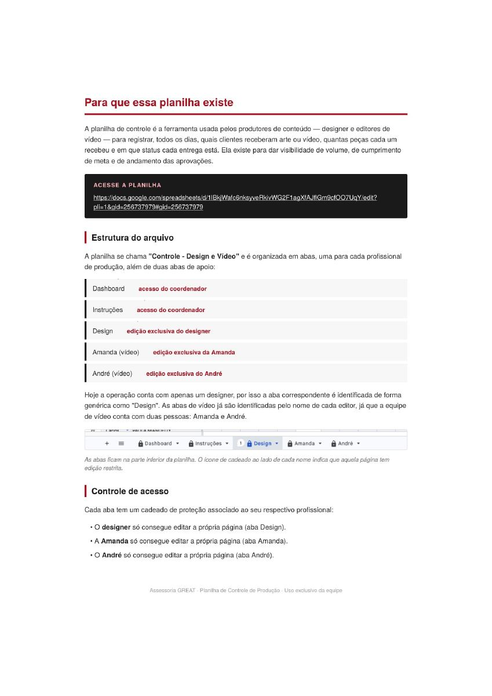

<details>

<summary>Transcrição textual da página</summary>

```
[Página sem texto extraível; consulte a imagem acima.]
```

</details>

## Página 21

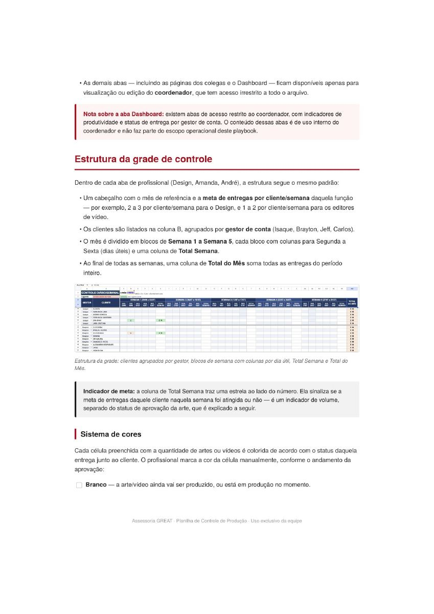

<details>

<summary>Transcrição textual da página</summary>

```
[Página sem texto extraível; consulte a imagem acima.]
```

</details>

## Página 22

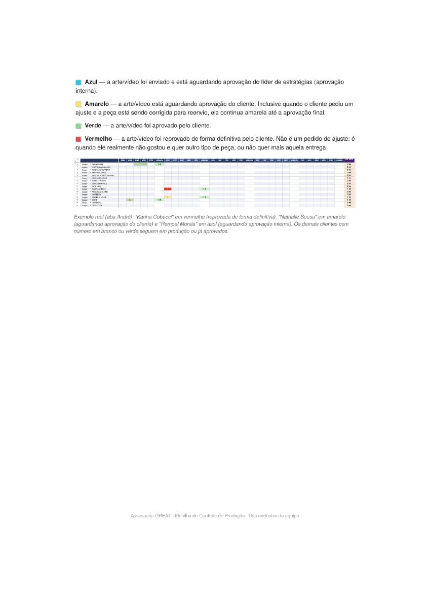

<details>

<summary>Transcrição textual da página</summary>

```
[Página sem texto extraível; consulte a imagem acima.]
```

</details>

## Página 23


<details>

<summary>Transcrição textual da página</summary>

```
↑ Voltar ao Início
```

</details>

## Página 24

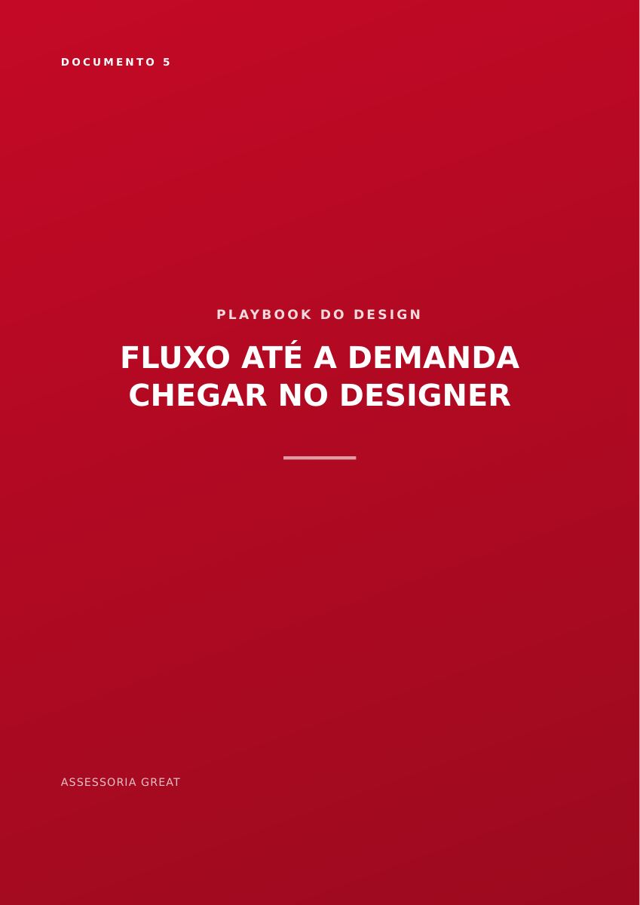

<details>

<summary>Transcrição textual da página</summary>

```
DOCUMENTO 5


   FLUXO ATÉ A DEMANDA
    CHEGAR NO DESIGNER
```

</details>

## Página 25

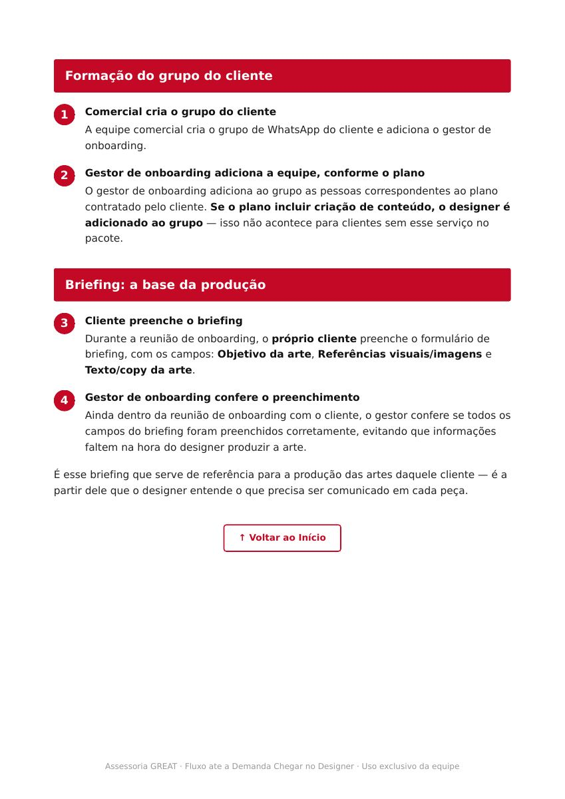

<details>

<summary>Transcrição textual da página</summary>

```
  Formação do grupo do cliente


 1     Comercial cria o grupo do cliente
       A equipe comercial cria o grupo de WhatsApp do cliente e adiciona o gestor de
       onboarding.

 2     Gestor de onboarding adiciona a equipe, conforme o plano
       O gestor de onboarding adiciona ao grupo as pessoas correspondentes ao plano
       contratado pelo cliente. Se o plano incluir criação de conteúdo, o designer é
       adicionado ao grupo — isso não acontece para clientes sem esse serviço no
       pacote.


  Briefing: a base da produção


 3     Cliente preenche o briefing
       Durante a reunião de onboarding, o próprio cliente preenche o formulário de
       briefing, com os campos: Objetivo da arte, Referências visuais/imagens e
       Texto/copy da arte.

 4     Gestor de onboarding confere o preenchimento
       Ainda dentro da reunião de onboarding com o cliente, o gestor confere se todos os
       campos do briefing foram preenchidos corretamente, evitando que informações
       faltem na hora do designer produzir a arte.

É esse briefing que serve de referência para a produção das artes daquele cliente — é a
partir dele que o designer entende o que precisa ser comunicado em cada peça.


                                          ↑ Voltar ao Início


           Assessoria GREAT · Fluxo ate a Demanda Chegar no Designer · Uso exclusivo da equipe
```

</details>

## Página 26

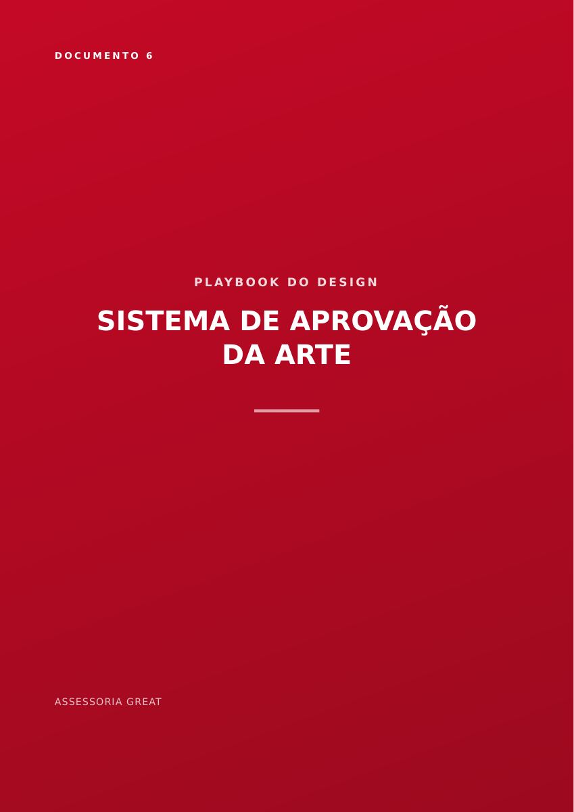

<details>

<summary>Transcrição textual da página</summary>

```
DOCUMENTO 6


   SISTEMA DE APROVAÇÃO
             DA ARTE
```

</details>

## Página 27

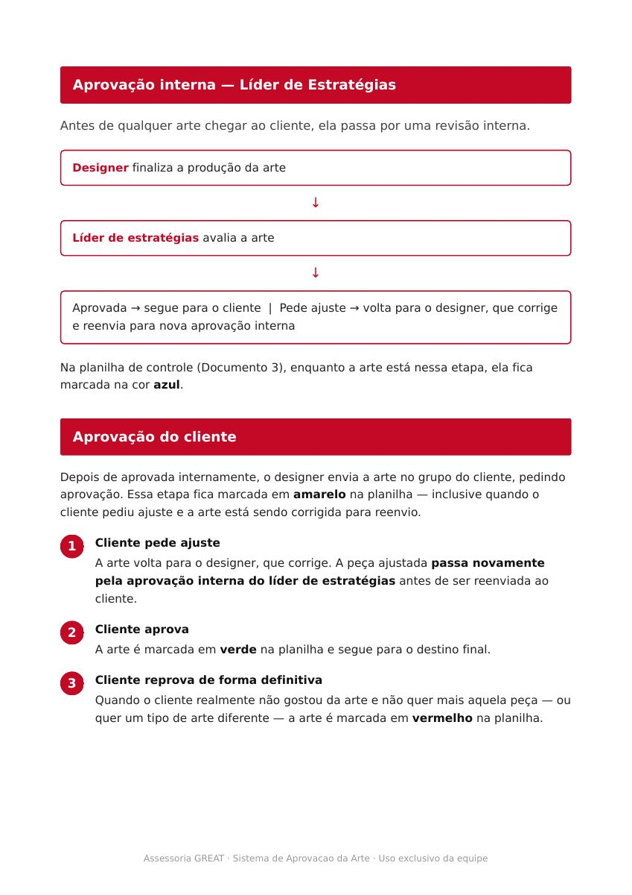

<details>

<summary>Transcrição textual da página</summary>

```
  Aprovação interna — Líder de Estratégias


Antes de qualquer arte chegar ao cliente, ela passa por uma revisão interna.


  Designer finaliza a produção da arte

                                                   ↓


  Líder de estratégias avalia a arte

                                                   ↓

  Aprovada → segue para o cliente  |  Pede ajuste → volta para o designer, que corrige
  e reenvia para nova aprovação interna


Na planilha de controle (Documento 3), enquanto a arte está nessa etapa, ela fica
marcada na cor azul.


  Aprovação do cliente


Depois de aprovada internamente, o designer envia a arte no grupo do cliente, pedindo
aprovação. Essa etapa fica marcada em amarelo na planilha — inclusive quando o
cliente pediu ajuste e a arte está sendo corrigida para reenvio.

 1     Cliente pede ajuste
       A arte volta para o designer, que corrige. A peça ajustada passa novamente
       pela aprovação interna do líder de estratégias antes de ser reenviada ao
       cliente.

 2     Cliente aprova
       A arte é marcada em verde na planilha e segue para o destino final.

 3     Cliente reprova de forma definitiva
       Quando o cliente realmente não gostou da arte e não quer mais aquela peça — ou
       quer um tipo de arte diferente — a arte é marcada em vermelho na planilha.


                 Assessoria GREAT · Sistema de Aprovacao da Arte · Uso exclusivo da equipe
```

</details>

## Página 28

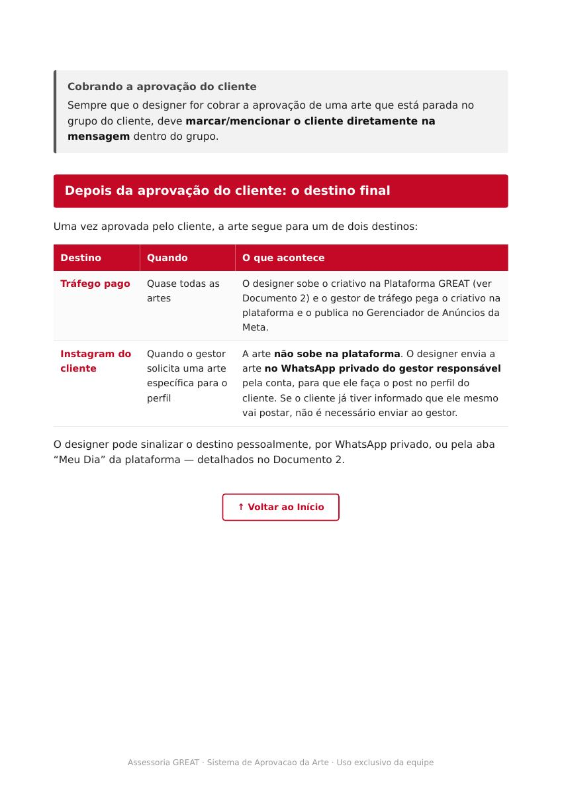

<details>

<summary>Transcrição textual da página</summary>

```
   Cobrando a aprovação do cliente
   Sempre que o designer for cobrar a aprovação de uma arte que está parada no
   grupo do cliente, deve marcar/mencionar o cliente diretamente na
   mensagem dentro do grupo.


  Depois da aprovação do cliente: o destino final


Uma vez aprovada pelo cliente, a arte segue para um de dois destinos:


 Destino          Quando            O que acontece

 Tráfego pago         Quase todas as         O designer sobe o criativo na Plataforma GREAT (ver
                      artes                  Documento 2) e o gestor de tráfego pega o criativo na
                                             plataforma e o publica no Gerenciador de Anúncios da
                                             Meta.

 Instagram do         Quando o gestor        A arte não sobe na plataforma. O designer envia a
 cliente              solicita uma arte      arte no WhatsApp privado do gestor responsável
                      específica para o      pela conta, para que ele faça o post no perfil do
                      perfil                 cliente. Se o cliente já tiver informado que ele mesmo
                                             vai postar, não é necessário enviar ao gestor.


O designer pode sinalizar o destino pessoalmente, por WhatsApp privado, ou pela aba
“Meu Dia” da plataforma — detalhados no Documento 2.


                                           ↑ Voltar ao Início


                 Assessoria GREAT · Sistema de Aprovacao da Arte · Uso exclusivo da equipe
```

</details>

## Página 29

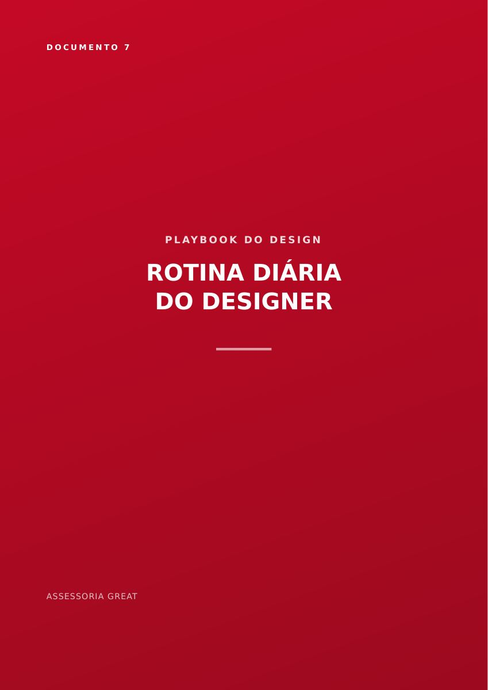

<details>

<summary>Transcrição textual da página</summary>

```
DOCUMENTO 7


         ROTINA DIÁRIA
          DO DESIGNER
```

</details>

## Página 30

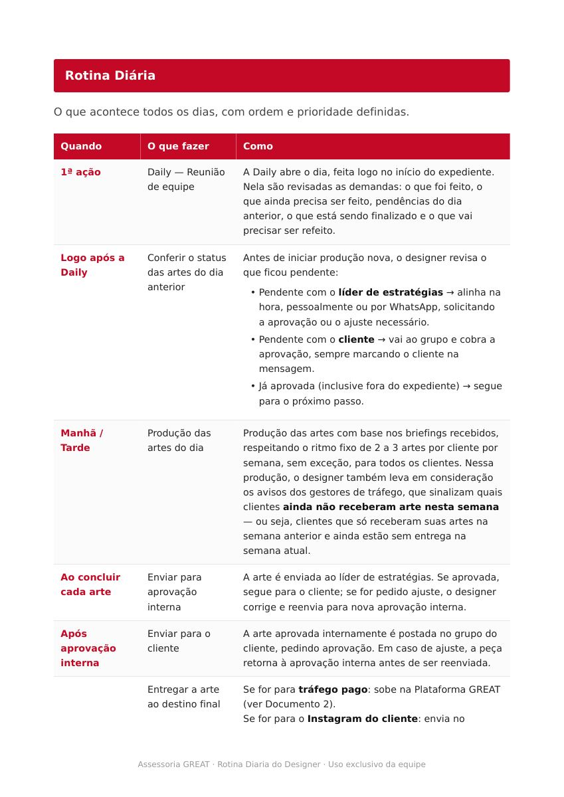

<details>

<summary>Transcrição textual da página</summary>

```
  Rotina Diária


O que acontece todos os dias, com ordem e prioridade definidas.


 Quando          O que fazer       Como

 1ª ação               Daily — Reunião         A Daily abre o dia, feita logo no início do expediente.
                       de equipe               Nela são revisadas as demandas: o que foi feito, o
                                               que ainda precisa ser feito, pendências do dia
                                               anterior, o que está sendo finalizado e o que vai
                                               precisar ser refeito.

 Logo após a           Conferir o status       Antes de iniciar produção nova, o designer revisa o
 Daily                 das artes do dia        que ficou pendente:
                       anterior                  • Pendente com o líder de estratégias → alinha na

                                                   hora, pessoalmente ou por WhatsApp, solicitando
                                                   a aprovação ou o ajuste necessário.
                                                 • Pendente com o cliente → vai ao grupo e cobra a
                                                   aprovação, sempre marcando o cliente na
                                                   mensagem.
                                                 • Já aprovada (inclusive fora do expediente) → segue
                                                   para o próximo passo.


 Manhã /               Produção das            Produção das artes com base nos briefings recebidos,
 Tarde                 artes do dia            respeitando o ritmo fixo de 2 a 3 artes por cliente por
                                               semana, sem exceção, para todos os clientes. Nessa
                                               produção, o designer também leva em consideração
                                               os avisos dos gestores de tráfego, que sinalizam quais
                                               clientes ainda não receberam arte nesta semana
                                               — ou seja, clientes que só receberam suas artes na
                                               semana anterior e ainda estão sem entrega na
                                               semana atual.

 Ao concluir           Enviar para             A arte é enviada ao líder de estratégias. Se aprovada,
 cada arte             aprovação               segue para o cliente; se for pedido ajuste, o designer
                       interna                 corrige e reenvia para nova aprovação interna.

 Após                  Enviar para o           A arte aprovada internamente é postada no grupo do
 aprovação             cliente                 cliente, pedindo aprovação. Em caso de ajuste, a peça
 interna                                       retorna à aprovação interna antes de ser reenviada.

                       Entregar a arte         Se for para tráfego pago: sobe na Plataforma GREAT
                       ao destino final        (ver Documento 2).
                                               Se for para o Instagram do cliente: envia no


                     Assessoria GREAT · Rotina Diaria do Designer · Uso exclusivo da equipe
```

</details>

## Página 31

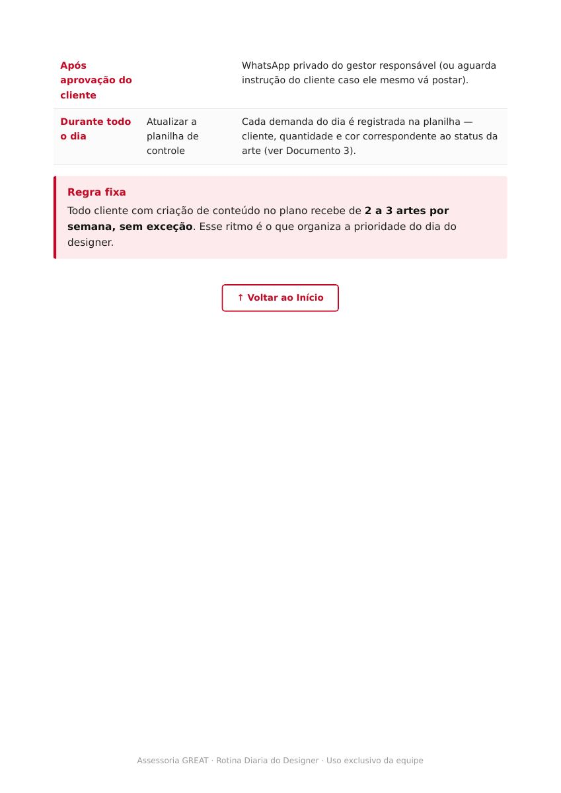

<details>

<summary>Transcrição textual da página</summary>

```
Após                                         WhatsApp privado do gestor responsável (ou aguarda
aprovação do                                 instrução do cliente caso ele mesmo vá postar).
cliente

Durante todo         Atualizar a             Cada demanda do dia é registrada na planilha —
o dia                planilha de             cliente, quantidade e cor correspondente ao status da
                     controle                arte (ver Documento 3).


 Regra fixa
 Todo cliente com criação de conteúdo no plano recebe de 2 a 3 artes por
 semana, sem exceção. Esse ritmo é o que organiza a prioridade do dia do
 designer.


                                           ↑ Voltar ao Início


                   Assessoria GREAT · Rotina Diaria do Designer · Uso exclusivo da equipe
```

</details>

## Página 32


<details>

<summary>Transcrição textual da página</summary>

```
DOCUMENTO 8


        COPY E CANVA:
   RECURSOS DO DESIGNER
```

</details>

## Página 33

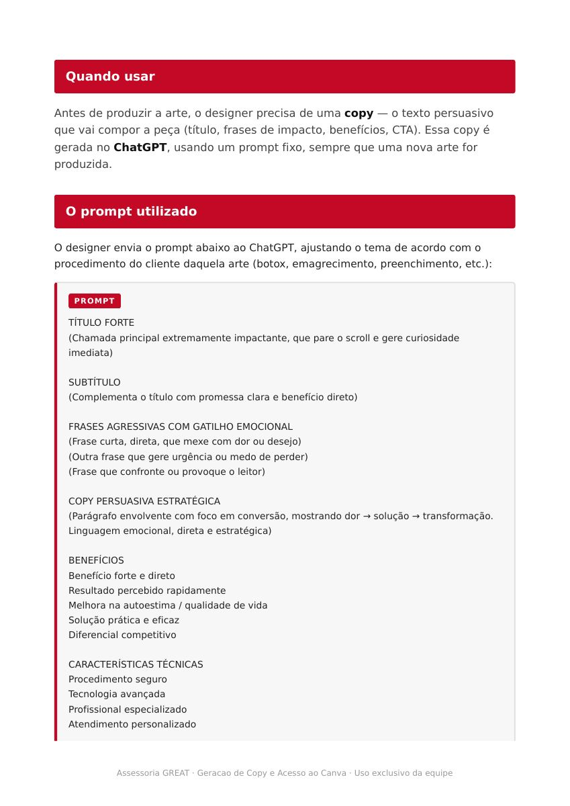

<details>

<summary>Transcrição textual da página</summary>

```
  Quando usar


Antes de produzir a arte, o designer precisa de uma copy — o texto persuasivo
que vai compor a peça (título, frases de impacto, benefícios, CTA). Essa copy é
gerada no ChatGPT, usando um prompt fixo, sempre que uma nova arte for
produzida.


  O prompt utilizado


O designer envia o prompt abaixo ao ChatGPT, ajustando o tema de acordo com o
procedimento do cliente daquela arte (botox, emagrecimento, preenchimento, etc.):


    PROMPT

   TÍTULO FORTE
   (Chamada principal extremamente impactante, que pare o scroll e gere curiosidade
   imediata)


   SUBTÍTULO
   (Complementa o título com promessa clara e benefício direto)


   FRASES AGRESSIVAS COM GATILHO EMOCIONAL
   (Frase curta, direta, que mexe com dor ou desejo)
   (Outra frase que gere urgência ou medo de perder)
   (Frase que confronte ou provoque o leitor)


   COPY PERSUASIVA ESTRATÉGICA
   (Parágrafo envolvente com foco em conversão, mostrando dor → solução → transformação.
   Linguagem emocional, direta e estratégica)


   BENEFÍCIOS
   Benefício forte e direto
   Resultado percebido rapidamente
   Melhora na autoestima / qualidade de vida
   Solução prática e eficaz
   Diferencial competitivo


   CARACTERÍSTICAS TÉCNICAS
   Procedimento seguro
   Tecnologia avançada
   Profissional especializado
   Atendimento personalizado


               Assessoria GREAT · Geracao de Copy e Acesso ao Canva · Uso exclusivo da equipe
```

</details>

## Página 34

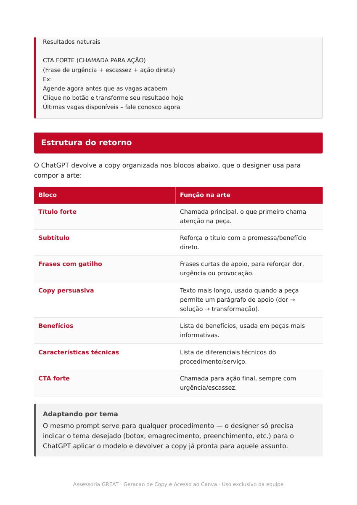

<details>

<summary>Transcrição textual da página</summary>

```
   Resultados naturais


   CTA FORTE (CHAMADA PARA AÇÃO)
   (Frase de urgência + escassez + ação direta)
   Ex:
   Agende agora antes que as vagas acabem
   Clique no botão e transforme seu resultado hoje
   Últimas vagas disponíveis – fale conosco agora


  Estrutura do retorno


O ChatGPT devolve a copy organizada nos blocos abaixo, que o designer usa para
compor a arte:


 Bloco                                            Função na arte

 Título forte                                           Chamada principal, o que primeiro chama
                                                        atenção na peça.

 Subtítulo                                              Reforça o título com a promessa/benefício
                                                        direto.

 Frases com gatilho                                     Frases curtas de apoio, para reforçar dor,
                                                        urgência ou provocação.

 Copy persuasiva                                        Texto mais longo, usado quando a peça
                                                        permite um parágrafo de apoio (dor →
                                                        solução → transformação).

 Benefícios                                             Lista de benefícios, usada em peças mais
                                                        informativas.

 Características técnicas                               Lista de diferenciais técnicos do
                                                        procedimento/serviço.

 CTA forte                                              Chamada para ação final, sempre com
                                                        urgência/escassez.


   Adaptando por tema
   O mesmo prompt serve para qualquer procedimento — o designer só precisa
   indicar o tema desejado (botox, emagrecimento, preenchimento, etc.) para o
   ChatGPT aplicar o modelo e devolver a copy já pronta para aquele assunto.


               Assessoria GREAT · Geracao de Copy e Acesso ao Canva · Uso exclusivo da equipe
```

</details>

## Página 35

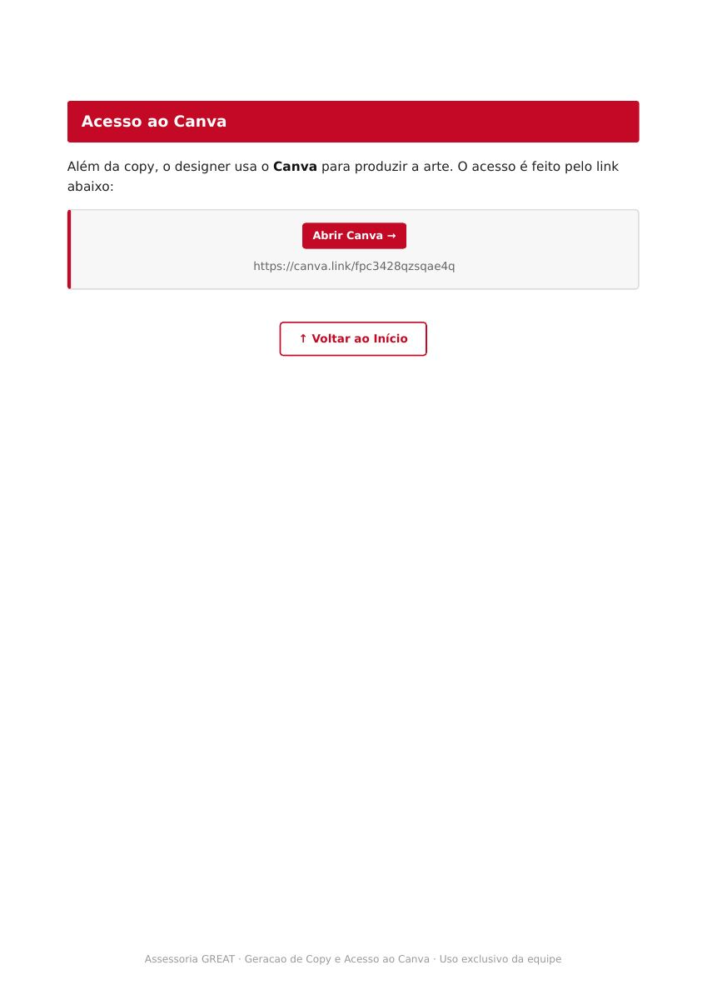

<details>

<summary>Transcrição textual da página</summary>

```
  Acesso ao Canva


Além da copy, o designer usa o Canva para produzir a arte. O acesso é feito pelo link
abaixo:


                                                 Abrir Canva →

                                     https://canva.link/fpc3428qzsqae4q


                                              ↑ Voltar ao Início


               Assessoria GREAT · Geracao de Copy e Acesso ao Canva · Uso exclusivo da equipe
```

</details>
