# A Metodologia - Case Raquel


**Transcrição integral:** `Metodologia_Case_Raquel.pdf`. O conteúdo abaixo mantém a ordem das páginas e o texto completo extraído do PDF. A imagem de cada página preserva tabelas, diagramas, capturas de tela e demais elementos visuais do original.


## Página 1


<details>
<summary>Transcrição textual da página</summary>

```text
           A S S E S S O R I A   G R E A T


          PLAYBOOK DE METODOLOGIA

A METODOLOGIA


           PARTE 1 — A METODOLOGIA  →


          PARTE 2 — GUIA DE APLICAÇÃO  →


                 ASSESSORIA GREAT
```

</details>

## Página 2

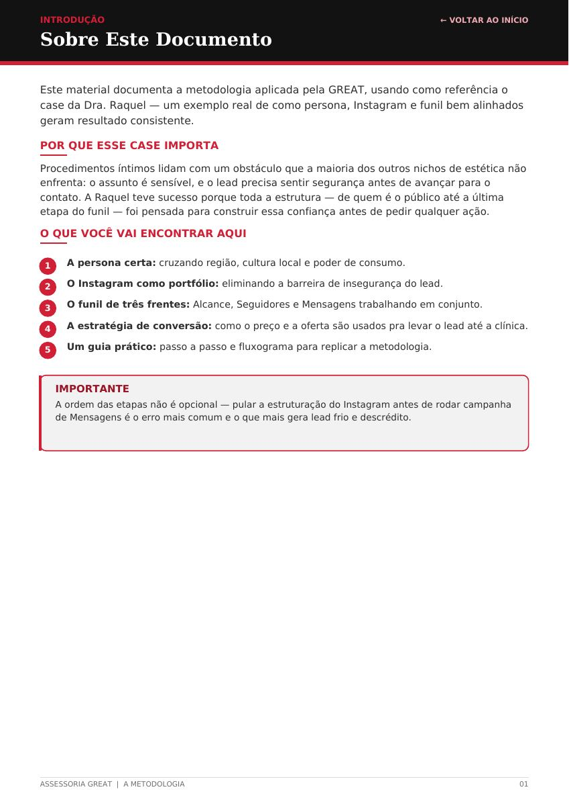

<details>
<summary>Transcrição textual da página</summary>

```text
INTRODUÇÃO                                                                                   ← VOLTAR AO INÍCIO
Sobre Este Documento


Este material documenta a metodologia aplicada pela GREAT, usando como referência o
case da Dra. Raquel — um exemplo real de como persona, Instagram e funil bem alinhados
geram resultado consistente.

POR QUE ESSE CASE IMPORTA

Procedimentos íntimos lidam com um obstáculo que a maioria dos outros nichos de estética não
enfrenta: o assunto é sensível, e o lead precisa sentir segurança antes de avançar para o
contato. A Raquel teve sucesso porque toda a estrutura — de quem é o público até a última
etapa do funil — foi pensada para construir essa confiança antes de pedir qualquer ação.

O QUE VOCÊ VAI ENCONTRAR AQUI


 1    A persona certa: cruzando região, cultura local e poder de consumo.

 2    O Instagram como portfólio: eliminando a barreira de insegurança do lead.

 3    O funil de três frentes: Alcance, Seguidores e Mensagens trabalhando em conjunto.

 4    A estratégia de conversão: como o preço e a oferta são usados pra levar o lead até a clínica.

 5    Um guia prático: passo a passo e fluxograma para replicar a metodologia.


   IMPORTANTE
   A ordem das etapas não é opcional — pular a estruturação do Instagram antes de rodar campanha
   de Mensagens é o erro mais comum e o que mais gera lead frio e descrédito.


ASSESSORIA GREAT  |  A METODOLOGIA                                                                             01
```

</details>

## Página 3

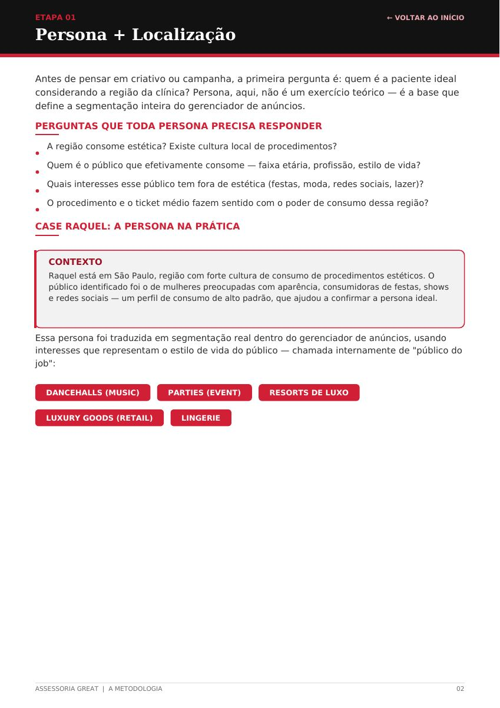

<details>
<summary>Transcrição textual da página</summary>

```text
ETAPA 01                                                                                     ← VOLTAR AO INÍCIO
Persona + Localização


Antes de pensar em criativo ou campanha, a primeira pergunta é: quem é a paciente ideal
considerando a região da clínica? Persona, aqui, não é um exercício teórico — é a base que
define a segmentação inteira do gerenciador de anúncios.

PERGUNTAS QUE TODA PERSONA PRECISA RESPONDER

   A região consome estética? Existe cultura local de procedimentos?

   Quem é o público que efetivamente consome — faixa etária, profissão, estilo de vida?

   Quais interesses esse público tem fora de estética (festas, moda, redes sociais, lazer)?

   O procedimento e o ticket médio fazem sentido com o poder de consumo dessa região?

CASE RAQUEL: A PERSONA NA PRÁTICA


   CONTEXTO
   Raquel está em São Paulo, região com forte cultura de consumo de procedimentos estéticos. O
   público identificado foi o de mulheres preocupadas com aparência, consumidoras de festas, shows
   e redes sociais — um perfil de consumo de alto padrão, que ajudou a confirmar a persona ideal.


Essa persona foi traduzida em segmentação real dentro do gerenciador de anúncios, usando
interesses que representam o estilo de vida do público — chamada internamente de "público do
job":


  DANCEHALLS (MUSIC)               PARTIES (EVENT)            RESORTS DE LUXO


  LUXURY GOODS (RETAIL)               LINGERIE


ASSESSORIA GREAT  |  A METODOLOGIA                                                                             02
```

</details>

## Página 4

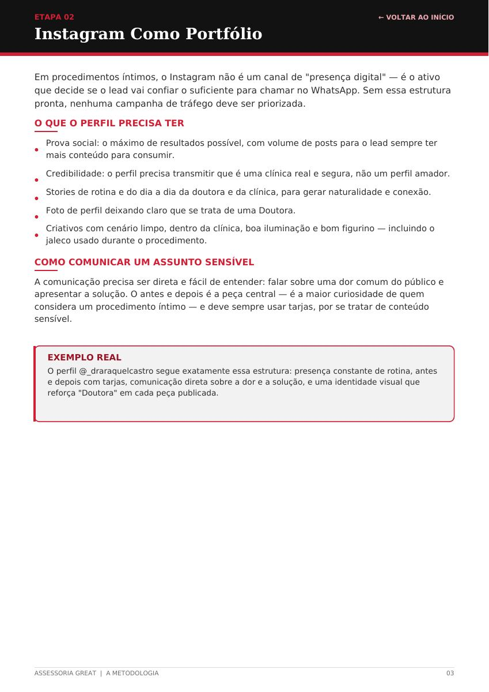

<details>
<summary>Transcrição textual da página</summary>

```text
ETAPA 02                                                                                      ← VOLTAR AO INÍCIO
Instagram Como Portfólio


Em procedimentos íntimos, o Instagram não é um canal de "presença digital" — é o ativo
que decide se o lead vai confiar o suficiente para chamar no WhatsApp. Sem essa estrutura
pronta, nenhuma campanha de tráfego deve ser priorizada.

O QUE O PERFIL PRECISA TER

   Prova social: o máximo de resultados possível, com volume de posts para o lead sempre ter
   mais conteúdo para consumir.

   Credibilidade: o perfil precisa transmitir que é uma clínica real e segura, não um perfil amador.

   Stories de rotina e do dia a dia da doutora e da clínica, para gerar naturalidade e conexão.

   Foto de perfil deixando claro que se trata de uma Doutora.

   Criativos com cenário limpo, dentro da clínica, boa iluminação e bom figurino — incluindo o
   jaleco usado durante o procedimento.

COMO COMUNICAR UM ASSUNTO SENSÍVEL

A comunicação precisa ser direta e fácil de entender: falar sobre uma dor comum do público e
apresentar a solução. O antes e depois é a peça central — é a maior curiosidade de quem
considera um procedimento íntimo — e deve sempre usar tarjas, por se tratar de conteúdo
sensível.


   EXEMPLO REAL
   O perfil @_draraquelcastro segue exatamente essa estrutura: presença constante de rotina, antes
   e depois com tarjas, comunicação direta sobre a dor e a solução, e uma identidade visual que
   reforça "Doutora" em cada peça publicada.


ASSESSORIA GREAT  |  A METODOLOGIA                                                                               03
```

</details>

## Página 5

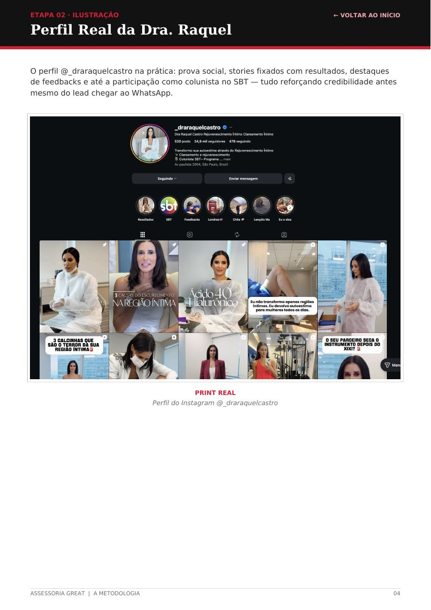

<details>
<summary>Transcrição textual da página</summary>

```text
ETAPA 02 · ILUSTRAÇÃO                                                                       ← VOLTAR AO INÍCIO
Perfil Real da Dra. Raquel


O perfil @_draraquelcastro na prática: prova social, stories fixados com resultados, destaques
de feedbacks e até a participação como colunista no SBT — tudo reforçando credibilidade antes
mesmo do lead chegar ao WhatsApp.


                                                  PRINT REAL
                                     Perfil do Instagram @_draraquelcastro


ASSESSORIA GREAT  |  A METODOLOGIA                                                                            04
```

</details>

## Página 6

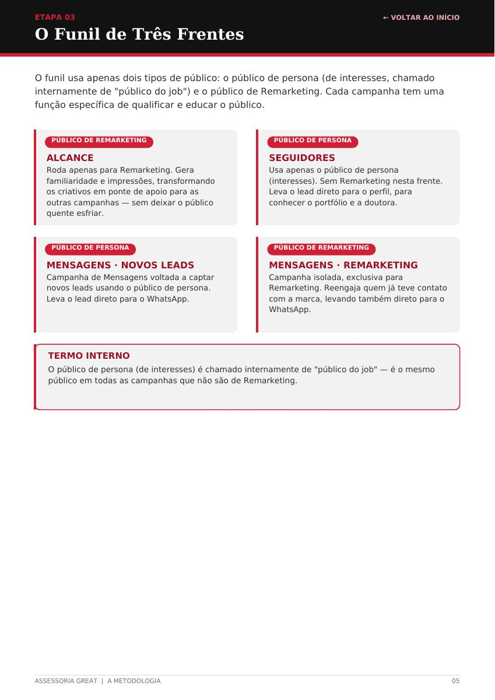

<details>
<summary>Transcrição textual da página</summary>

```text
ETAPA 03                                                                                        ← VOLTAR AO INÍCIO
O Funil de Três Frentes


O funil usa apenas dois tipos de público: o público de persona (de interesses, chamado
internamente de "público do job") e o público de Remarketing. Cada campanha tem uma
função específica de qualificar e educar o público.


    PÚBLICO DE REMARKETING                                        PÚBLICO DE PERSONA

   ALCANCE                                                      SEGUIDORES
   Roda apenas para Remarketing. Gera                           Usa apenas o público de persona
   familiaridade e impressões, transformando                    (interesses). Sem Remarketing nesta frente.
   os criativos em ponte de apoio para as                       Leva o lead direto para o perfil, para
   outras campanhas — sem deixar o público                      conhecer o portfólio e a doutora.
   quente esfriar.


    PÚBLICO DE PERSONA                                            PÚBLICO DE REMARKETING

   MENSAGENS · NOVOS LEADS                                      MENSAGENS · REMARKETING
   Campanha de Mensagens voltada a captar                       Campanha isolada, exclusiva para
   novos leads usando o público de persona.                     Remarketing. Reengaja quem já teve contato
   Leva o lead direto para o WhatsApp.                          com a marca, levando também direto para o
                                                                WhatsApp.


   TERMO INTERNO
   O público de persona (de interesses) é chamado internamente de "público do job" — é o mesmo
   público em todas as campanhas que não são de Remarketing.


ASSESSORIA GREAT  |  A METODOLOGIA                                                                                 05
```

</details>

## Página 7

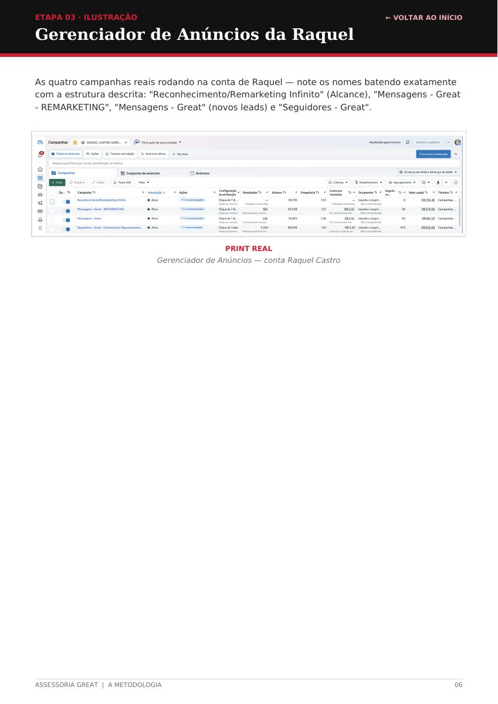

<details>
<summary>Transcrição textual da página</summary>

```text
ETAPA 03 · ILUSTRAÇÃO                                                                    ← VOLTAR AO INÍCIO
Gerenciador de Anúncios da Raquel


As quatro campanhas reais rodando na conta de Raquel — note os nomes batendo exatamente
com a estrutura descrita: "Reconhecimento/Remarketing Infinito" (Alcance), "Mensagens - Great
- REMARKETING", "Mensagens - Great" (novos leads) e "Seguidores - Great".


                                                PRINT REAL
                               Gerenciador de Anúncios — conta Raquel Castro


ASSESSORIA GREAT  |  A METODOLOGIA                                                                        06
```

</details>

## Página 8

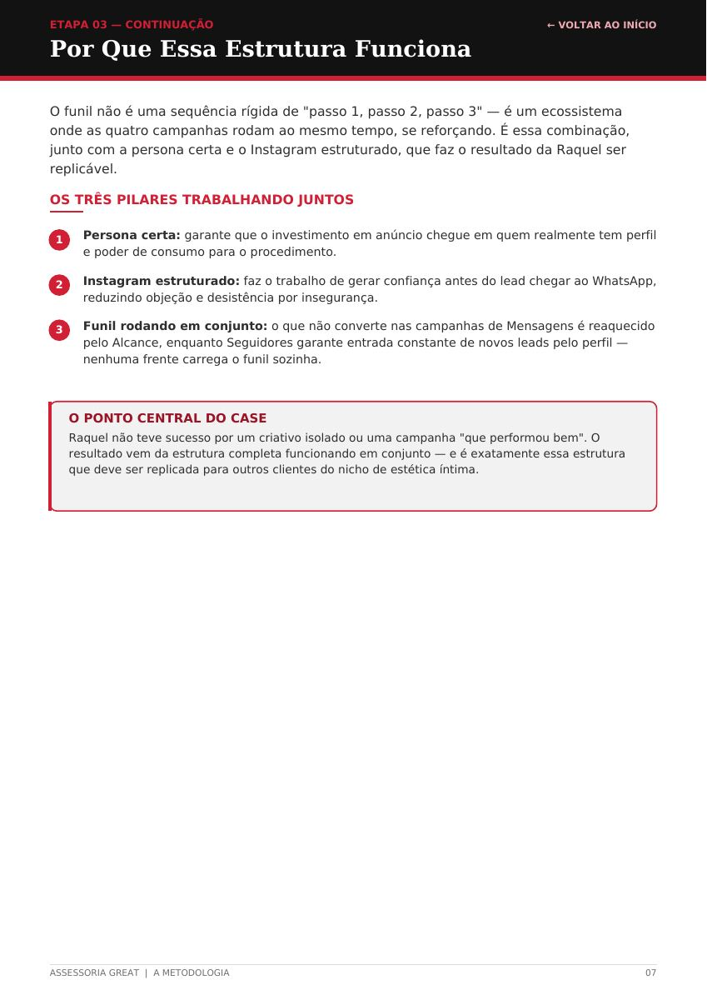

<details>
<summary>Transcrição textual da página</summary>

```text
ETAPA 03 — CONTINUAÇÃO                                                                      ← VOLTAR AO INÍCIO
Por Que Essa Estrutura Funciona


O funil não é uma sequência rígida de "passo 1, passo 2, passo 3" — é um ecossistema
onde as quatro campanhas rodam ao mesmo tempo, se reforçando. É essa combinação,
junto com a persona certa e o Instagram estruturado, que faz o resultado da Raquel ser
replicável.

OS TRÊS PILARES TRABALHANDO JUNTOS


 1    Persona certa: garante que o investimento em anúncio chegue em quem realmente tem perfil
      e poder de consumo para o procedimento.

 2    Instagram estruturado: faz o trabalho de gerar confiança antes do lead chegar ao WhatsApp,
      reduzindo objeção e desistência por insegurança.

 3    Funil rodando em conjunto: o que não converte nas campanhas de Mensagens é reaquecido
      pelo Alcance, enquanto Seguidores garante entrada constante de novos leads pelo perfil —
      nenhuma frente carrega o funil sozinha.


   O PONTO CENTRAL DO CASE
   Raquel não teve sucesso por um criativo isolado ou uma campanha "que performou bem". O
   resultado vem da estrutura completa funcionando em conjunto — e é exatamente essa estrutura
   que deve ser replicada para outros clientes do nicho de estética íntima.


ASSESSORIA GREAT  |  A METODOLOGIA                                                                            07
```

</details>

## Página 9

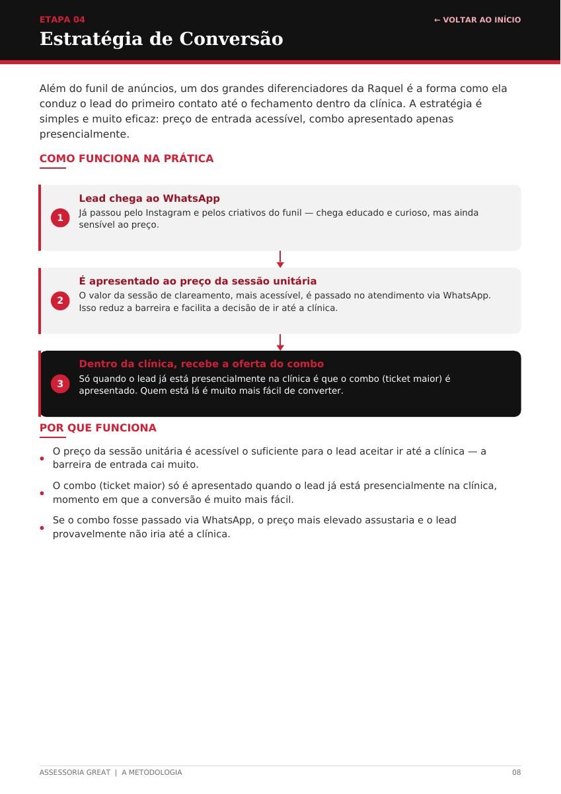

<details>
<summary>Transcrição textual da página</summary>

```text
ETAPA 04                                                                                        ← VOLTAR AO INÍCIO
Estratégia de Conversão


Além do funil de anúncios, um dos grandes diferenciadores da Raquel é a forma como ela
conduz o lead do primeiro contato até o fechamento dentro da clínica. A estratégia é
simples e muito eficaz: preço de entrada acessível, combo apresentado apenas
presencialmente.

COMO FUNCIONA NA PRÁTICA


         Lead chega ao WhatsApp
    1    Já passou pelo Instagram e pelos criativos do funil — chega educado e curioso, mas ainda
         sensível ao preço.


         É apresentado ao preço da sessão unitária
    2    O valor da sessão de clareamento, mais acessível, é passado no atendimento via WhatsApp.
         Isso reduz a barreira e facilita a decisão de ir até a clínica.


         Dentro da clínica, recebe a oferta do combo
    3    Só quando o lead já está presencialmente na clínica é que o combo (ticket maior) é
         apresentado. Quem está lá é muito mais fácil de converter.


POR QUE FUNCIONA

   O preço da sessão unitária é acessível o suficiente para o lead aceitar ir até a clínica — a
   barreira de entrada cai muito.

   O combo (ticket maior) só é apresentado quando o lead já está presencialmente na clínica,
   momento em que a conversão é muito mais fácil.

   Se o combo fosse passado via WhatsApp, o preço mais elevado assustaria e o lead
   provavelmente não iria até a clínica.


ASSESSORIA GREAT  |  A METODOLOGIA                                                                                08
```

</details>

## Página 10

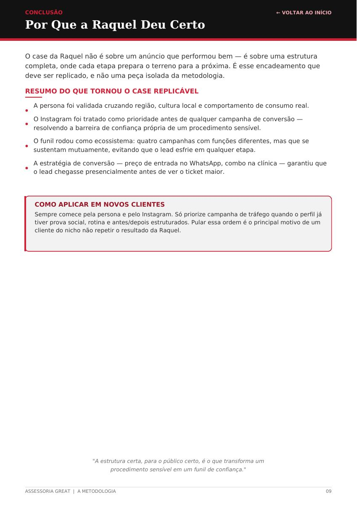

<details>
<summary>Transcrição textual da página</summary>

```text
CONCLUSÃO                                                                                     ← VOLTAR AO INÍCIO
Por Que a Raquel Deu Certo


O case da Raquel não é sobre um anúncio que performou bem — é sobre uma estrutura
completa, onde cada etapa prepara o terreno para a próxima. É esse encadeamento que
deve ser replicado, e não uma peça isolada da metodologia.

RESUMO DO QUE TORNOU O CASE REPLICÁVEL

   A persona foi validada cruzando região, cultura local e comportamento de consumo real.

   O Instagram foi tratado como prioridade antes de qualquer campanha de conversão —
   resolvendo a barreira de confiança própria de um procedimento sensível.

   O funil rodou como ecossistema: quatro campanhas com funções diferentes, mas que se
   sustentam mutuamente, evitando que o lead esfrie em qualquer etapa.

   A estratégia de conversão — preço de entrada no WhatsApp, combo na clínica — garantiu que
   o lead chegasse presencialmente antes de ver o ticket maior.


   COMO APLICAR EM NOVOS CLIENTES
   Sempre comece pela persona e pelo Instagram. Só priorize campanha de tráfego quando o perfil já
   tiver prova social, rotina e antes/depois estruturados. Pular essa ordem é o principal motivo de um
   cliente do nicho não repetir o resultado da Raquel.


                         "A estrutura certa, para o público certo, é o que transforma um
                                procedimento sensível em um funil de confiança."


ASSESSORIA GREAT  |  A METODOLOGIA                                                                              09
```

</details>

## Página 11

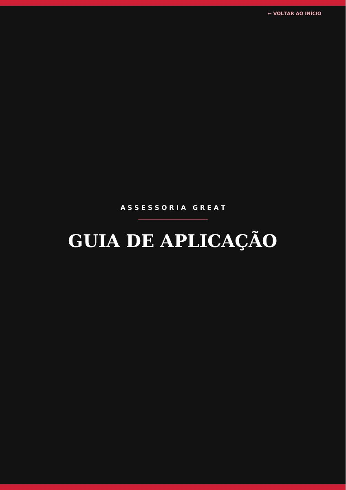

<details>
<summary>Transcrição textual da página</summary>

```text
                                            ← VOLTAR AO INÍCIO


           A S S E S S O R I A   G R E A T

GUIA DE APLICAÇÃO
```

</details>

## Página 12

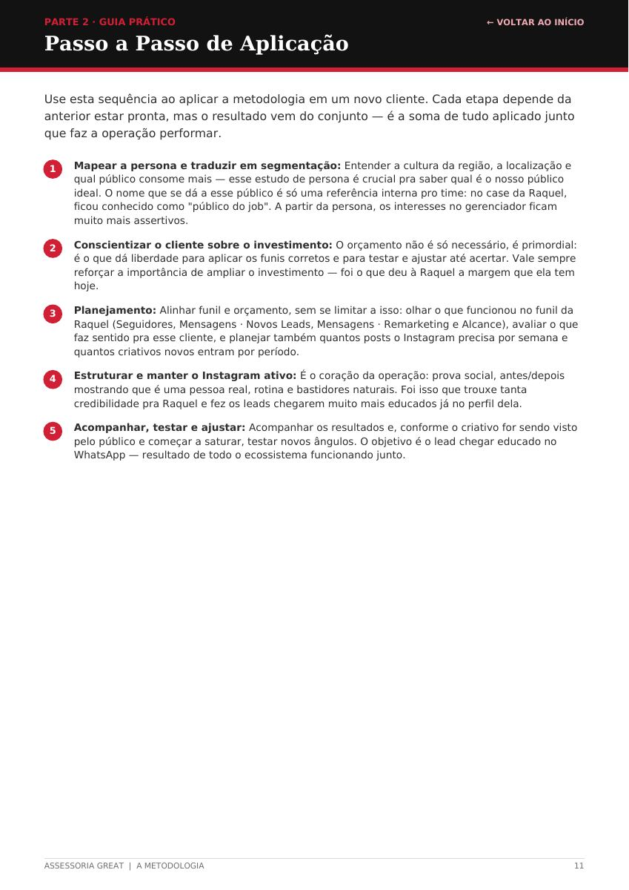

<details>
<summary>Transcrição textual da página</summary>

```text
PARTE 2 · GUIA PRÁTICO                                                                               ← VOLTAR AO INÍCIO
Passo a Passo de Aplicação


Use esta sequência ao aplicar a metodologia em um novo cliente. Cada etapa depende da
anterior estar pronta, mas o resultado vem do conjunto — é a soma de tudo aplicado junto
que faz a operação performar.


 1    Mapear a persona e traduzir em segmentação: Entender a cultura da região, a localização e
      qual público consome mais — esse estudo de persona é crucial pra saber qual é o nosso público
      ideal. O nome que se dá a esse público é só uma referência interna pro time: no case da Raquel,
      ficou conhecido como "público do job". A partir da persona, os interesses no gerenciador ficam
      muito mais assertivos.

 2    Conscientizar o cliente sobre o investimento: O orçamento não é só necessário, é primordial:
      é o que dá liberdade para aplicar os funis corretos e para testar e ajustar até acertar. Vale sempre
      reforçar a importância de ampliar o investimento — foi o que deu à Raquel a margem que ela tem
      hoje.

 3    Planejamento: Alinhar funil e orçamento, sem se limitar a isso: olhar o que funcionou no funil da
      Raquel (Seguidores, Mensagens · Novos Leads, Mensagens · Remarketing e Alcance), avaliar o que
      faz sentido pra esse cliente, e planejar também quantos posts o Instagram precisa por semana e
      quantos criativos novos entram por período.

 4    Estruturar e manter o Instagram ativo: É o coração da operação: prova social, antes/depois
      mostrando que é uma pessoa real, rotina e bastidores naturais. Foi isso que trouxe tanta
      credibilidade pra Raquel e fez os leads chegarem muito mais educados já no perfil dela.

 5    Acompanhar, testar e ajustar: Acompanhar os resultados e, conforme o criativo for sendo visto
      pelo público e começar a saturar, testar novos ângulos. O objetivo é o lead chegar educado no
      WhatsApp — resultado de todo o ecossistema funcionando junto.


ASSESSORIA GREAT  |  A METODOLOGIA                                                                                       11
```

</details>

## Página 13

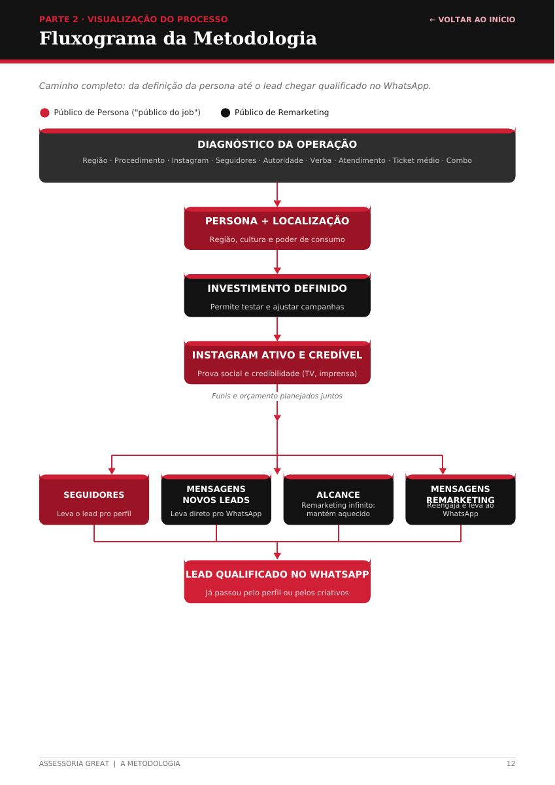

<details>
<summary>Transcrição textual da página</summary>

```text
PARTE 2 · VISUALIZAÇÃO DO PROCESSO                                                                   ← VOLTAR AO INÍCIO
Fluxograma da Metodologia


Caminho completo: da definição da persona até o lead chegar qualificado no WhatsApp.


   Público de Persona ("público do job")          Público de Remarketing


                                         DIAGNÓSTICO DA OPERAÇÃO

           Região · Procedimento · Instagram · Seguidores · Autoridade · Verba · Atendimento · Ticket médio · Combo


                                           PERSONA + LOCALIZAÇÃO

                                            Região, cultura e poder de consumo


                                           INVESTIMENTO DEFINIDO

                                            Permite testar e ajustar campanhas


                                       INSTAGRAM ATIVO E CREDÍVEL

                                         Prova social e credibilidade (TV, imprensa)


                                            Funis e orçamento planejados juntos


      SEGUIDORES                      MENSAGENS                         ALCANCE                      MENSAGENS
                                     NOVOS LEADS                    Remarketing infinito:           REMARKETINGReengaja e leva ao
    Leva o lead pro perfil        Leva direto pro WhatsApp           mantém aquecido                     WhatsApp


                                      LEAD QUALIFICADO NO WHATSAPP

                                           Já passou pelo perfil ou pelos criativos


ASSESSORIA GREAT  |  A METODOLOGIA                                                                                       12
```

</details>

## Página 14

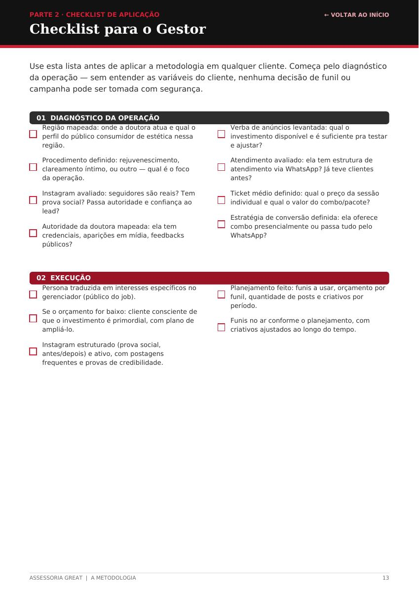

<details>
<summary>Transcrição textual da página</summary>

```text
PARTE 2 · CHECKLIST DE APLICAÇÃO                                                                       ← VOLTAR AO INÍCIO
Checklist para o Gestor


Use esta lista antes de aplicar a metodologia em qualquer cliente. Começa pelo diagnóstico
da operação — sem entender as variáveis do cliente, nenhuma decisão de funil ou
campanha pode ser tomada com segurança.


  01  DIAGNÓSTICO DA OPERAÇÃO
    Região mapeada: onde a doutora atua e qual o                      Verba de anúncios levantada: qual o
    perfil do público consumidor de estética nessa                    investimento disponível e é suficiente pra testar
    região.                                                           e ajustar?

    Procedimento definido: rejuvenescimento,                          Atendimento avaliado: ela tem estrutura de
    clareamento íntimo, ou outro — qual é o foco                      atendimento via WhatsApp? Já teve clientes
    da operação.                                                      antes?

    Instagram avaliado: seguidores são reais? Tem                     Ticket médio definido: qual o preço da sessão
    prova social? Passa autoridade e confiança ao                     individual e qual o valor do combo/pacote?
    lead?                                                             Estratégia de conversão definida: ela oferece

    Autoridade da doutora mapeada: ela tem                            combo presencialmente ou passa tudo pelo
    credenciais, aparições em mídia, feedbacks                        WhatsApp?
    públicos?


  02  EXECUÇÃO
    Persona traduzida em interesses específicos no                    Planejamento feito: funis a usar, orçamento por
    gerenciador (público do job).                                     funil, quantidade de posts e criativos por
    Se o orçamento for baixo: cliente consciente de                   período.

    que o investimento é primordial, com plano de                     Funis no ar conforme o planejamento, com
    ampliá-lo.                                                        criativos ajustados ao longo do tempo.

    Instagram estruturado (prova social,
    antes/depois) e ativo, com postagens
    frequentes e provas de credibilidade.


ASSESSORIA GREAT  |  A METODOLOGIA                                                                                          13
```

</details>
